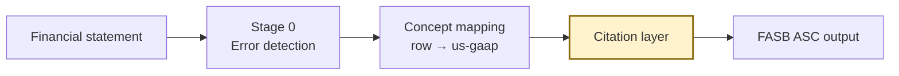
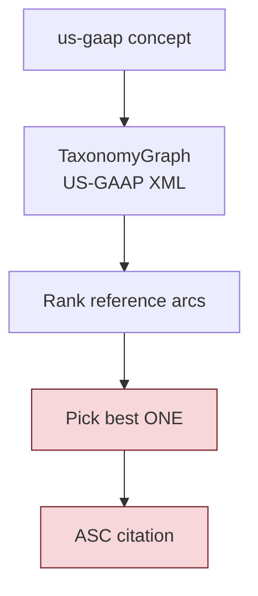
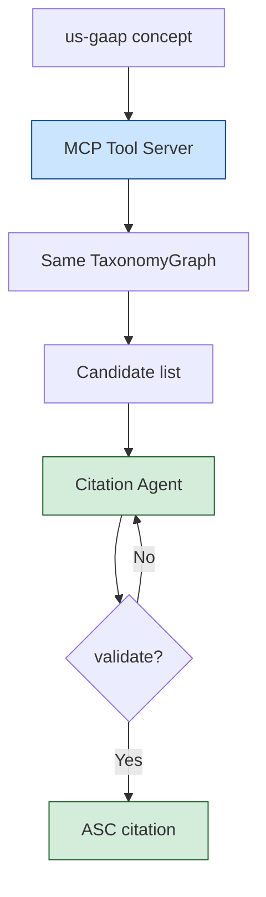
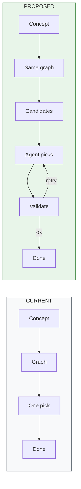
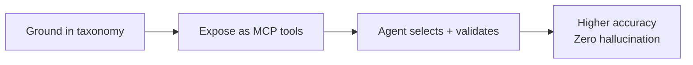

# Citation Architecture: Current vs Proposed

**IntelliAudit · Stage 1 Citation Layer**  
*Presentation brief — diagrams render in GitHub / Cursor / Markdown preview*

---

## Slide 1 — The change in one line

| | Citation decision |
|--|--|
| **Current** | Taxonomy graph picks **one** ASC automatically |
| **Proposed** | Same graph returns a **candidate list**; an agent **selects → validates → retries** |

> Stage 0 (error detection) and concept mapping stay the same.  
> Only the citation step changes.

---

## Slide 2 — Full pipeline (unchanged shell)

**Yellow box = only piece we redesign**

---

## Slide 3 — Current architecture

| | Current |
|--|--|
| Source | Real FASB taxonomy (no invented codes) |
| Decision | Single automatic pick |
| Agent / LLM | None |
| Weakness | Often picks **presentation** topic (e.g. 210) instead of **subject-matter** (e.g. 350) |

---

## Slide 4 — Proposed architecture

| Tool | Job |
|------|-----|
| `get_candidates` | All ASC codes for the concept |
| `validate_citation` | Accept only if code ∈ candidate list |
| `store_pick` | Save final grounded citation |

**Agent cannot invent ASC codes.** Invalid picks are rejected; loop retries (max 2–3).

---

## Slide 5 — Side by side

| | Current | Proposed |
|--|---------|----------|
| Taxonomy | US-GAAP graph | **Same graph** |
| Choices considered | Best 1 | Full candidate set |
| Who decides | Fixed ranker | Agent + validate |
| Invent ASC? | No | **No** (tool-blocked) |
| Iteration | None | 2–3 retries |
| Scope of AI | — | **Citation only** |

---

## Slide 6 — Results (AuditBench sample)

| Method | Topic match |
|--------|-------------|
| **Current** (single pick) | **19.1%** |
| **Proposed** (agent + validate) | **21.4%** |
| Candidate ceiling | 26.2% |
| GPT-4 paper baseline | ~26% |

| Metric | Proposed |
|--------|----------|
| Lift vs current | **+2.4 pts** |
| Grounded accepts | **100%** |
| Hallucinated ASC | **0** |

---

## Slide 7 — Example corrections

| Line item | Current | Proposed | Truth |
|-----------|---------|----------|-------|
| Goodwill | **210** | **350** | 350 |
| Property & equipment | **852** | **360** | 360 |
| Revenue | **280** | **606** | 606 |
| Cash | **210** | **230** | 230 |

Same taxonomy source → better **selection**, not a new database.

---

## Slide 8 — Takeaway

1. **Current** solves grounding (citations come from FASB XML).  
2. **Gap:** grounding ≠ correct topic when many refs exist.  
3. **Proposed:** keep the graph as authority; let an agent choose among candidates with validation.  
4. **Win:** measurable lift + 0 invented ASC codes + clear audit trail.

---

## Appendix — Repo map (optional slide)

| Component | Path |
|-----------|------|
| Taxonomy graph | `taxonomy_graph.py` |
| MCP tools / server | `citation_mcp/` |
| A vs B eval | `citation_mcp/eval_agent.py` |
| This brief | `ARCHITECTURE_COMPARISON.md` |
