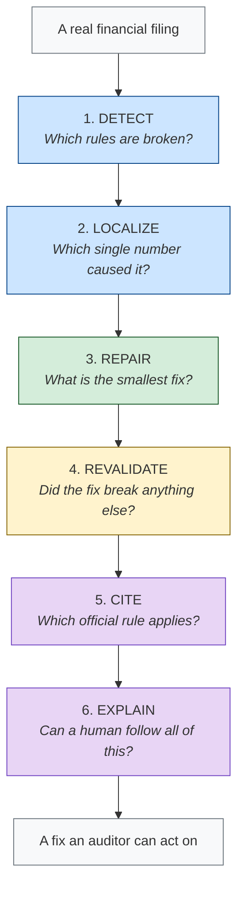
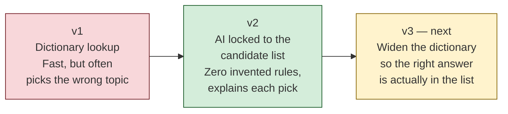

# The Architecture

*A short deck: what we have settled on, and what we are still improving*

---

## Slide 1 — The one idea

We are not proposing a single model or a single trick.

We are proposing a **shape** — a fixed sequence of stages that any system fixing
financial filings has to go through.

That shape is what we have learned and are confident about.

**Inside** each stage, the best method is still an open question. That is where
we keep experimenting: a better way to cite, a better way to stop the AI making
things up, a better way to pick which number is guilty.

> The frame is settled. The parts are swappable.

---

## Slide 2 — The architecture

Six stages. Each one asks a question the previous stage cannot answer.

---

## Slide 3 — Why these six, and not fewer

Each stage exists because skipping it causes a specific failure.

| Skip this | And you get |
|---|---|
| Detect | No idea anything is wrong |
| Localize | "Something is wrong somewhere" — useless to an auditor |
| Repair | A diagnosis with no action attached |
| Revalidate | A fix that quietly breaks three other things |
| Cite | A change nobody is allowed to sign off on |
| Explain | A correct answer no human will trust |

This is why we believe the shape is right. Every stage is load-bearing.

---

## Slide 4 — Fixed question, open method

This is the important slide. Each stage has a **question we are sure about** and
a **method we are still choosing**.

| Stage | The question (settled) | The method (still improving) |
|---|---|---|
| **Detect** | Which rules are broken? | Which rule sets to support, how many error types to cover |
| **Localize** | Which single fact caused it? | How to choose when several numbers could be the culprit |
| **Repair** | What is the smallest valid fix? | How to solve backwards when part of the filing is missing |
| **Revalidate** | Did anything else break? | How wide to re-check — the statement, or the whole filing |
| **Cite** | Which official rule applies? | Lookup, AI, or both — and how to widen the dictionary |
| **Explain** | Can a human follow it? | Template text vs AI-written, and how to verify the AI's prose |

The left column has not changed since we started. The right column changes
almost every week.

---

## Slide 5 — Example: the CITE stage keeps moving

One stage, three versions, to show what "swapping a part" looks like.

What we found going from v1 to v2: hallucinated citations dropped to **zero**,
but accuracy did not move — because the right answer was usually missing from
the list we gave the AI. That is what points at v3.

**The architecture never changed.** Only the contents of one box did.

---

## Slide 6 — The rule that holds in every stage

Whatever method we swap in, one constraint stays.

> **Anything may propose. Only the checks may accept.**

A lookup table, a heuristic, an AI — any of them can suggest an answer. None of
them can approve their own answer. A suggestion becomes a result only after it
passes the stage's test.

This is what lets us experiment freely inside a stage without ever putting an
unverified change into a financial filing.

---

## Slide 7 — Why this framing helps us

**We can improve without redesigning.** A better citation method drops into one
box. Nothing upstream or downstream has to change.

**Every change is measurable where it happens.** We can score the CITE stage on
its own, independently of whether the repair was right.

**Failures point somewhere specific.** When results are poor we can say which
stage is responsible, instead of blaming "the model."

**Honest reporting gets easier.** We can say "this stage is strong, this stage is
weak" rather than defending one aggregate number.

---

## Slide 8 — Where we are

**Settled:** the six-stage architecture, and the propose-versus-accept rule.

**Working well:** detect, localize, repair, and revalidate — currently pure
calculation, no AI, fully reproducible.

**Actively changing:** cite and explain — this is where the AI lives, and where
our experiments are focused right now.

**Next:** widen the citation dictionary, and put the AI explanation layer over
the repairs we already produce.
