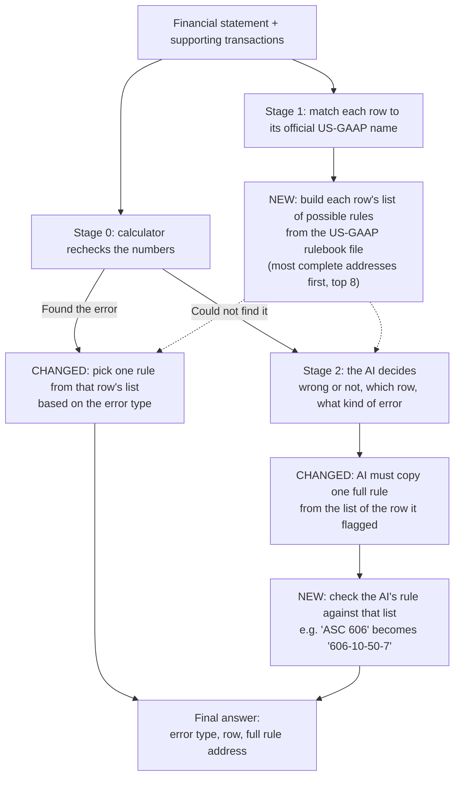

# Citation upgrade

Improved on top of Daksh's Stage 2 AI (branch `daksh/stage2-iab-v03`). It does **not** change how errors
are found, or when the AI is called. It changes **how the pipeline names the
accounting rule** that was broken.

## The problem in plain terms

Every accounting rule has an address, like a book, chapter and page:

| Part of `ASC 606-10-25-23` | Meaning | Example |
|---|---|---|
| `606` | Book (topic) | Revenue |
| `10` | Chapter (subtopic) | Overall |
| `25-23` | Page (section + paragraph) | The exact sentence that applies |

The exam gives full marks only for the exact page. Before this change, the
pipeline usually named only the book (`ASC 606`), so it could never score on
chapter or page.

## How the pipeline works (unchanged)

1. **Stage 0, the calculator.** Rechecks the numbers. If it proves a row is
   wrong, it says which row and what kind of error. No AI.
2. **Stage 1, the rule lookup.** For each row, looks up the matching rules in the
   official US-GAAP rulebook file. No AI.
3. **Stage 2, the AI.** Runs only when the calculator can't find the error.
   It decides whether the statement is wrong, which row, what kind of error, and
   which rule applies.

## The new pipeline at a glance

Boxes marked **NEW** or **CHANGED** are what this branch adds. Everything else
is the existing pipeline as it was.



## What we changed

**1. We added a list of possible rules to every row (Stage 1).**
Each line of the statement now carries a short list of the accounting rules
that could apply to it. The list is filled like this:

1. The existing mapper matches the row's label (for example "Purchases of
   property, plant and equipment") to its official US-GAAP name
   (`PaymentsToAcquirePropertyPlantAndEquipment`).
2. We look that name up in the official US-GAAP 2025 rulebook file and collect
   every rule linked to it. If the name itself has no rules, we use its closest
   parent name.
3. We add the rule the lookup already picked for that row.
4. We remove duplicates and put the most complete addresses first (a full page
   like `230-10-45-13` before a chapter like `230-10-45`). SEC staff notes
   (`S99`) go below real paragraphs of the same length.
5. We keep the top 8.

If the row's label isn't recognised, the list gets the general layout rule for
that statement instead (balance sheet 210, income statement 220, cash flow 230).

> Example: `Purchases of property, plant and equipment → [230-10-45-13, 230-10-45]`

**2. When the calculator finds the error, the rule is chosen by error type (Stage 1).**
Before, we took the lookup's first guess, which was often the wrong book. Now we
pick from the row's list based on the kind of error the calculator found: a
wrong number points to the book about measuring that item, a line in the wrong
section points to the book about statement layout. The answer key is never used.

**3. The AI is told to copy one full address from the list (Stage 2).**
Before, its instructions said "name the book." Now it sees each row's full list
and must copy one complete address, never just a book number.

**4. The AI's answer is checked against the list (Stage 2).**
The AI doesn't always follow instructions, so after it answers, plain code (not
a second AI) matches its rule to the list for the row it flagged. If it writes
`ASC 606`, that becomes the most complete `606-...` address on the list. If it
writes a page number that isn't on the list, we don't keep the invented part.

## Before and after

Same 54 exam items from IntelliAudit-Bench, same AI (`gpt-4o-mini`), same random
sample. Rule scores count the 18 items that have an official rule to cite.

| What we measure | Before | After |
|---|---|---|
| Answers that named only a book (`ASC 230`) | 45 | **0** |
| Right book | 44% (8 of 18) | **50%** (9 of 18) |
| Right book and chapter | 0% | **50%** (9 of 18) |
| Right exact page | 0% | 0% |
| Calculator finds the error | 9 of 54 | 9 of 54 (unchanged) |

**When the calculator finds the error by itself (no AI):**

| Correct rule | Before | After |
|---|---|---|
| `606-10-25-23` (revenue) | `270-10-50-1` (wrong book) | `606-10-50-7` (right chapter) |
| `350-20-35-1` (goodwill) | `210-10-S99-1` (wrong book) | `350-20-55-24` (right chapter) |

## Why this is better

Before, the pipeline answered like a student who writes "see the Revenue
textbook." Now it answers "Revenue textbook, chapter 10, page 50." It still
often lands on the wrong page, but it gets the right chapter half the time
instead of never, and every answer now comes from the official rulebook instead
of the AI's memory.

## What is still wrong

The exact page is still 0%. We found three reasons:

1. **The AI flags the wrong row, so it picks from the wrong list.** On the cash
   flow items, the correct rule (`230-10-45-13`) was in the right row's list,
   but the AI flagged "Net income" instead.
2. **For some lines, the correct page isn't in the rulebook file.** Revenue links
   only to disclosure pages (`606-10-50-...`). The correct page, `606-10-25-23`,
   is not linked to revenue at all.
3. **Some lists fill up with niche rules.** "Net income" links to 38 rules; the
   top 8 slots currently go to specialised rules (investment companies,
   transition rules) instead of general ones.

The AI also still says almost every statement it sees is wrong (44 of 45).

These numbers come from one run on 54 items, so small differences such as one
extra correct book (8 → 9) can be noise. The chapter jump (0 → 9) is not.

## Files changed

| File | Change |
|---|---|
| `approaches/stage1_taxonomy_citation/citation_select.py` | New. Picks one rule from a list; matches the AI's answer to the list |
| `approaches/stage1_taxonomy_citation/stage1_arelle.py` | Fills each row's list of possible rules |
| `approaches/full_pipeline/pipeline.py` | Chooses the rule by error type when the calculator fires |
| `approaches/stage2_llm_audit/stage2_llm.py` | New AI instructions; checks its answer against the list |
| `approaches/full_pipeline/run_iab_exam.py` | New. Runs the IntelliAudit-Bench exam and prints scores with and without the AI |

## Run it

Put an OpenRouter key in `.env` at the repo root (this file is git-ignored):

```
OPENROUTER_API_KEY=sk-or-...
```

Then:

```bash
python3 -m approaches.full_pipeline.run_iab_exam --n 54 --seed 42 --stage2 --bench /path/to/IntelliAudit
```
