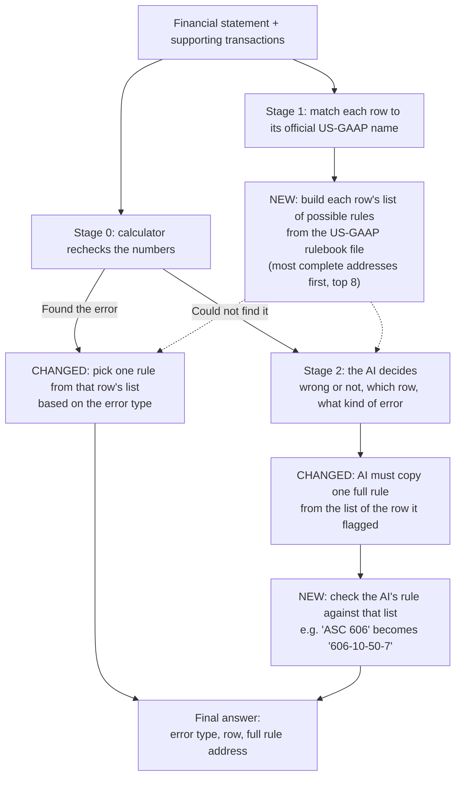

# Citation upgrade

Improved on top of Daksh's Stage 2 AI (branch `daksh/stage2-iab-v03`). How errors
are found is unchanged. What changed is **how the pipeline names the accounting
rule** that was broken.

## The problem

Every accounting rule has an address, like a book, chapter and page:

| Part of `ASC 606-10-25-23` | Meaning | Example |
|---|---|---|
| `606` | Book (topic) | Revenue |
| `10` | Chapter (subtopic) | Overall |
| `25-23` | Page (section + paragraph) | The exact sentence that applies |

The exam gives full marks only for the exact page. The pipeline usually named
only the book (`ASC 606`), so it could never score on chapter or page.

## The new pipeline

Stage 0 is a calculator that rechecks the numbers. Stage 1 looks up rules in the
official US-GAAP rulebook file. Stage 2 is the AI, used only when the calculator
can't find the error. Boxes marked **NEW** or **CHANGED** are what this branch
adds.



## What we changed

1. **Every row gets a list of possible rules.** The row's label is matched to its
   official US-GAAP name, then every rule linked to that name in the rulebook
   file is collected. Most complete addresses go first, and the top 8 are kept.
   No AI is involved. Example: `Purchases of property, plant and equipment →
   [230-10-45-13, 230-10-45]`.
2. **When the calculator finds the error, the rule is picked by error type.** A
   wrong number points to the book about measuring that item; a line in the
   wrong section points to the book about statement layout.
3. **The AI must copy one full address from the list**, never just a book number.
4. **Plain code checks the AI's answer against the list.** `ASC 606` becomes the
   most complete `606-...` address on the list, and invented page numbers are
   dropped.

## Before and after

Same 54 items from the first version of the IntelliAudit-Bench exam (every item
has an official rule), same scoring, same AI (`gpt-4o-mini`). Scores are out of
all 54 items.

| Setup | Right book | Right book and chapter | Right exact page |
|---|---|---|---|
| Before, no AI | 27.8% | 16.7% | 0% |
| Before, with AI | 57.4% | 18.5% | 0% |
| **After, with AI** | **66.7%** | **55.6%** | **7.4%** |

Before, the AI answered with just a book (`ASC 230`) 23 times; after, never. On
the current exam (only 18 of 54 items have an official rule), right book and
chapter went from 1 of 18 to 8 of 18. These are single runs, so small
differences can be noise.

## Why the exact page is still low

1. **The AI flags the wrong row**, so it picks from the wrong list. On cash flow
   items the correct rule (`230-10-45-13`) was in the right row's list, but the
   AI flagged "Net income".
2. **Some correct pages aren't linked in the rulebook file.** Revenue links only
   to disclosure pages (`606-10-50-...`), never to `606-10-25-23`.
3. **Lists fill up with niche rules.** "Net income" links to 38 rules, and the
   top 8 go to specialised ones (investment companies, transition rules).

## Next steps to raise the 7%

1. **Help the AI find the right row.** Give it the calculator's hints (which
   totals don't add up) and check its row against the error type. For example,
   a cash flow misclassification can't be on "Net income".
2. **Rank general rules first.** Push industry-specific books (800 and above)
   and transition rules (`-65-`) to the bottom so general rules fit in the top 8.
3. **Pick the page section by error type.** Within the right chapter, a wrong
   number points to measurement sections (`30`, `35`), a misplaced line to
   presentation (`45`), and a made-up line to recognition (`25`).
4. **Fill missing rulebook links.** Add a small, hand-checked table of core
   paragraphs the rulebook file doesn't link, taken from the accounting
   standards and never from the answer key (for example, revenue →
   `606-10-25-23`).
5. **Confirm on the full exam** and several random samples before quoting final
   numbers.

## Files changed

| File | Change |
|---|---|
| `approaches/stage1_taxonomy_citation/citation_select.py` | New. Picks one rule from a list; checks the AI's answer against it |
| `approaches/stage1_taxonomy_citation/stage1_arelle.py` | Fills each row's list of possible rules |
| `approaches/full_pipeline/pipeline.py` | Picks the rule by error type when the calculator fires |
| `approaches/stage2_llm_audit/stage2_llm.py` | New AI instructions; checks its answer |
| `approaches/full_pipeline/run_iab_exam.py` | New. Runs the exam with and without the AI |

## Run it

Put `OPENROUTER_API_KEY=sk-or-...` in `.env` at the repo root (git-ignored), then:

```bash
python3 -m approaches.full_pipeline.run_iab_exam --n 54 --seed 42 --stage2 --bench /path/to/IntelliAudit
```
