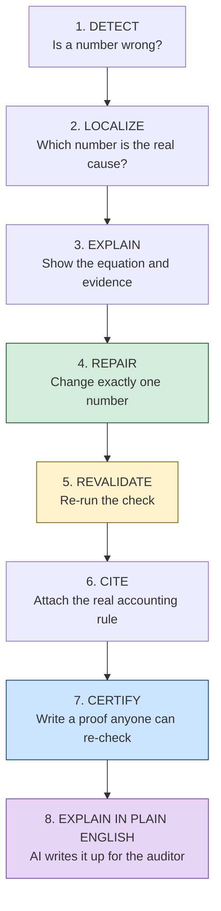
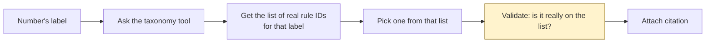
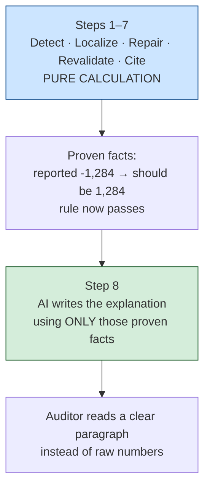

# AuditPatch — Finding and Fixing Errors in Financial Reports

**SFU Capstone Presentation**
*Everything explained from scratch — no prior accounting or AI knowledge needed*

---

## Slide 1 — The everyday problem

Every public company must publish financial reports. Those reports contain
thousands of numbers, and the numbers must add up correctly.

Sometimes they don't. A number is typed wrong, or has the wrong sign, or a
total doesn't match the items above it.

Today a human auditor hunts for these mistakes by hand. It is slow, expensive,
and easy to miss things.

**Our question:** can software find the mistake, fix it, and *prove* the fix is
correct?

---

## Slide 2 — Words you need (only four)

**XBRL** — the computer format companies use to file reports. Think of it as a
spreadsheet written in a language machines can read, where every number has a
label like `Inventory` or `Goodwill`.

**US-GAAP taxonomy** — the official dictionary of those labels, published by the
accounting standards board. It says which labels exist and which accounting
rule each one belongs to.

**DQC rules** — official quality-check rules for filings. Example: "this
particular number must never be negative." They are written by the industry,
not by us, and not by an AI.

**FASB ASC citation** — the ID of an accounting rule, like `ASC 350-20-45-1`.
Similar to citing a law by section number.

---

## Slide 3 — Why not just ask ChatGPT?

That was tried. It fails in two ways.

An AI asked to audit a statement gets the **arithmetic** wrong sometimes, and
gets the **rule citation** wrong most of the time — it invents rule numbers that
look real but don't exist, because it is recalling from memory rather than
looking anything up.

Inventing a legal citation is unacceptable in auditing. So a pure-AI system is
the wrong tool for this job.

---

## Slide 4 — Our idea in one sentence

> Let software **check the math** and **look up the real rules**, and only let
> a fix count as valid if it passes those checks.

We do not ask a model to be trustworthy. We build a system where being wrong is
caught automatically.

---

## Slide 5 — The pipeline



Steps 1–7 are small and boring on purpose. Boring means checkable. Step 8 is
where the AI comes in — and only there. We come back to it on Slide 10.

---

## Slide 6 — Step 2 explained: why "localize" matters

One wrong number breaks many totals at once.

```text
Accounts Receivable is wrong
      ↓
Total current assets is now wrong
      ↓
Total assets is now wrong
      ↓
Assets = Liabilities + Equity fails
```

A naive tool reports **four problems**. But there is only **one** real cause.

We report the single root cause — the original wrong number — instead of
drowning the auditor in alerts.

---

## Slide 7 — Step 6 explained: how we avoid inventing rules

Instead of asking a model "what rule applies here?", we look it up.



If a rule ID is not on the official list, it is rejected. An invented citation
cannot get through. We wrapped this lookup as an **MCP server**, which simply
means "a standard way to offer tools to an AI assistant."

---

## Slide 8 — The data we tested on

**FinMR** — 332 real cases taken from actual company filings submitted to the
SEC. Each case is a real quality-rule failure.

Why this dataset matters: the correct answers come from the **official DQC
rules**, not from a person's opinion and not from an AI. So when we compare our
repair to the correct answer, the comparison is honest.

Each case tells us two things: what the company **reported**, and what the rule
says it **should have been**.

---

## Slide 9 — What our system produces

For one real case:

```text
Rule broken : This number must not be negative
The number  : PaymentsToAcquirePropertyPlantAndEquipment
Period      : Sep 1 2021 – Nov 30 2021
Reported    : -1,284
Should be   :  1,284
Our fix     : change that one number to 1,284
Re-check    : rule now passes, nothing else broke
Citation    : ASC 230-10-45-13   (verified as real)
```

A reviewer can check every line of that by hand. Nothing is hidden inside a
model.

---

## Slide 10 — Where the AI fits in

Everything so far was pure calculation. The AI enters at exactly **one** place:
turning the proven result into a human explanation.



**The key design choice:** by the time the AI is called, the answer is already
decided and proven. The AI cannot change a single number. It can only describe
what the calculation already established.

This is the opposite of asking an AI to audit the filing. We ask it to *write up*
an audit that has already been verified.

---

## Slide 11 — Why the explanation matters

Our system currently outputs this:

```text
PaymentsToAcquirePropertyPlantAndEquipment reported as -1284;
rule requires a non-negative value, so the correct value is 1284.
```

Correct, but it reads like a machine. A real auditor wants context.

With the AI explanation layer, the same proven facts become:

```text
The company recorded its purchases of property and equipment as a negative
number (-1,284) in the cash flow statement. Under the reporting rules, this
element is defined as an outflow already, so the value must be entered as a
positive figure — the negative sign double-counts the direction.

The correct value is 1,284. Changing this single number resolves the issue
and does not affect any other figure in the filing.

Governing standard: ASC 230-10-45-13 (Statement of Cash Flows).
```

Same facts. Same numbers. Far more usable for the person who has to act on it.

The next three slides cover the experiment we ran to test whether an AI can be
trusted to write that paragraph without making anything up.

---

## Slide 12 — The AI is boxed in

Three hard limits keep this safe.

**It receives only proven facts.** The AI is handed the certificate — the concept,
the old value, the verified new value, the rule, the citation. It never sees a
blank page and it never sees the raw filing to reinterpret.

**It cannot output numbers of its own.** We compare every figure in its
explanation against the certificate. If a number appears that we did not compute,
the explanation is rejected and we fall back to the plain machine sentence.

**It cannot change the repair.** The fix was accepted by the validator before the
AI was ever called. The AI writes prose; it does not touch the filing.

> The calculator decides. The AI narrates.

---

## Slide 13 — The experiment we ran on the AI

We did not just assume this design works. We ran a controlled experiment on the
hardest AI failure in this domain: **the AI inventing accounting rule numbers.**

**The question.** If we stop the AI from answering from memory, and instead force
it to answer only from a real lookup tool, does it stop making things up — and
can it explain each choice?

**The setup.** Three versions picked the citation for the same 42 line items:

| Version | How it decides |
|---|---|
| **A — Lookup only** | Software picks the first match from the dictionary. No AI. |
| **B — AI, tool-locked** | Claude Haiku 4.5 sees only the real candidate list and must pick one from it, giving a written reason |
| **C — Ceiling** | A perfect chooser, always picking the best option available in the list |

The important part of B: the AI **never** types a citation freely. It is shown
the real candidates and must choose one, and its choice is then checked against
the dictionary before we accept it.

---

## Slide 14 — What the experiment found

| Measure | A: Lookup | B: AI, tool-locked | C: Ceiling |
|---|---|---|---|
| Correct topic | 19.0% | 19.0% | 26.2% |
| **Invented citations** | 0 | **0** | 0 |
| **Accepted answers that were verified real** | 100% | **100%** | 100% |
| Written reason for the choice | none | **every case** | none |
| Average retries needed | — | 0.93 | — |

**The headline: zero hallucinated citations out of 42.** Published work reports
that an AI asked this question from memory invents rule numbers a large share of
the time. Tool-locking removed that failure completely — not reduced it, removed
it.

And every answer came with an explanation. A real one from the run:

```text
Concept: PropertyPlantAndEquipmentNet
Lookup alone picked : ASC 852  (Reorganizations — wrong)
AI picked           : ASC 360

AI's reason: "ASC 360 (Property, Plant, and Equipment) is the subject-matter
standard for PP&E accounting and measurement, making it the appropriate
citation for the net carrying value of property and equipment regardless of
statement presentation."
```

That paragraph is the deliverable. A reviewer can agree or disagree with it —
which is exactly what you cannot do with a model that just emits an answer.

---

## Slide 15 — What we learned from it

**The honest result: accuracy did not improve.** The AI scored 19.0%, the same as
plain lookup. We are reporting that rather than hiding it, because *why* it
happened is the useful finding.

The ceiling was 26.2%. That is the score of a *perfect* chooser given the same
candidate list. So no amount of better prompting or a bigger model could have
pushed the AI past 26.2% — **the correct answer was simply missing from the
candidate list most of the time.** The bottleneck is the lookup, not the AI.

Two conclusions we take forward:

**1. Grounding solves hallucination but not coverage.** Locking the AI to a tool
made it trustworthy and explainable. Making it *more accurate* now means
improving the dictionary it reads from — a different problem.

**2. This is why the AI narrates instead of decides.** The experiment showed the
AI is reliable at explaining a constrained choice and limited by the evidence it
is given. So we let it do the first thing and let verified calculation do the
second.

---

## Slide 16 — Results

We ran all 332 real cases.

| What we measured | Result |
|---|---|
| Repairs we proposed | 178 |
| Repairs that exactly matched the correct answer | **145 (81.5%)** |
| Repairs that broke something else | **0** |
| Numbers changed per repair | **1** |
| Repairs with a verified real citation | 166 (93%) |

The **0** matters as much as the 81.5%. Every fix we accepted left the rest of
the filing untouched and valid.

---

## Slide 17 — Where we are strong and weak

Three types of rule were tested.

**Strong — totals (97% correct).** When a total should equal the sum of the
items under it, we recompute the sum and fix the total. This is pure arithmetic
and we do it very reliably.

**Strong — signs (85% correct).** When a number must not be negative, the fix is
obvious once detected.

**Weak — solving for a missing piece (36% correct).** Here we must work
backwards from a total and all its other items. If the dataset gives us only
part of the filing, we cannot compute the answer.

We are open about that third case rather than hiding it.

---

## Slide 18 — When we say "I don't know"

In 147 of the 332 cases, the filing excerpt did not include the facts we needed.

We **abstain** in those cases instead of guessing.

That is a deliberate choice. A wrong repair to a financial filing is worse than
no repair at all. An auditing tool that guesses cannot be trusted.

---

## Slide 19 — The rule that makes this safe

> **The system may propose. Only the checks may accept.**

A repair is accepted only if all three are true:

1. It removes the original problem
2. It changes exactly one number
3. It creates no new problem anywhere else

If any one fails, the repair is thrown away.

This is exactly why the AI layer is safe. The AI writes the explanation *after*
these three tests have already passed, and if we later let it suggest fixes for
tricky wording cases, its suggestions face the same three tests.

---

## Slide 20 — What makes this different

Existing research mostly asks: *is this filing wrong?*

We ask the next question: *what exactly caused it, what is the smallest correct
fix, and can we prove the fix is safe?*

Detection tells an auditor there is a problem. A verified repair tells them what
to do about it.

---

## Slide 21 — Summary

We built a system that reads real financial filings, finds the one number
causing a rule failure, fixes it with a single change, re-checks the filing to
prove nothing else broke, and attaches a real accounting citation looked up from
the official dictionary.

On 332 real cases it produced the exactly correct fix **81.5%** of the time,
never broke anything else, never invented a citation, and said "I don't know"
whenever the evidence was incomplete.

On top of that verified result sits the AI explanation layer. We tested it on the
riskiest task in this domain — choosing an accounting citation — and locking the
AI to a real lookup tool produced **zero invented citations across 42 cases**,
with a written justification for every choice. It did not beat plain lookup on
accuracy, and we showed why: the correct answer was usually absent from the
candidate list, capping *any* chooser at 26.2%.

That is the division of labour we are proposing. Verified calculation decides.
The AI explains.

---

## Slide 22 — What's next

The experiment pointed at the real bottleneck, so that is where we go next.

**Widen the candidate list.** Accuracy was capped at 26.2% because the right
answer was often missing from the lookup. Fixing the dictionary raises the
ceiling for every method at once.

**Run the explanation layer over the repair certificates.** We proved the
mechanism on citations; the same tool-locked setup applied to the 178 repairs
would give every one of them a readable write-up. Then measure whether reviewers
actually prefer them.

**Let the AI propose on ambiguous cases** — company-invented labels that no
formula can resolve — with every proposal still forced through the same three
acceptance tests.

Throughout, the boundary holds: the AI may propose and explain, never accept.

---

## Reproduce our results

Main pipeline (Slides 16–18):

```bash
source .venv/bin/activate
python -m audit_patch.run_finmr        # all 332 cases
python -m audit_patch.run_finmr --n 40 # quick version
```

The AI explainability experiment (Slides 13–15):

```bash
python -m citation_mcp.eval_agent --n 50                      # A: lookup only
python -m citation_mcp.eval_agent --mode llm \
    --model claude/claude-haiku-4-5 --n 50                    # B: AI, tool-locked
python -m citation_mcp.eval_agent --mode oracle --n 50        # C: ceiling
```

Full numbers: `FINMR_RESULTS.md`, `results/audit_patch_finmr_332.json`, and
`results/citation_mcp_llm_50.json`
