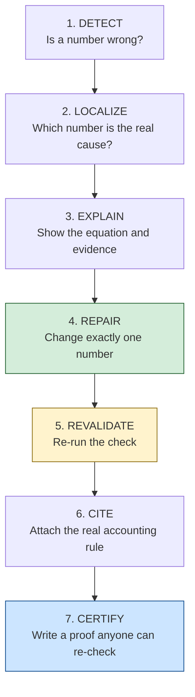
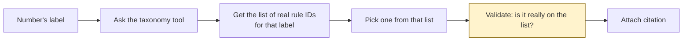

# AuditPatch — Finding and Fixing Errors in Financial Reports

**SFU Capstone Presentation**
*Everything explained from scratch — no prior accounting or AI knowledge needed*

---

## Slide 1 — The everyday problem

Every public company must publish financial reports. Those reports contain
thousands of numbers, and the numbers must add up correctly.

Sometimes they don't. A number is typed wrong, or has the wrong sign, or a
total doesn't match the items above it.

Today a human auditor hunts for these mistakes by hand. It is slow, expensive,
and easy to miss things.

**Our question:** can software find the mistake, fix it, and *prove* the fix is
correct?

---

## Slide 2 — Words you need (only four)

**XBRL** — the computer format companies use to file reports. Think of it as a
spreadsheet written in a language machines can read, where every number has a
label like `Inventory` or `Goodwill`.

**US-GAAP taxonomy** — the official dictionary of those labels, published by the
accounting standards board. It says which labels exist and which accounting
rule each one belongs to.

**DQC rules** — official quality-check rules for filings. Example: "this
particular number must never be negative." They are written by the industry,
not by us, and not by an AI.

**FASB ASC citation** — the ID of an accounting rule, like `ASC 350-20-45-1`.
Similar to citing a law by section number.

---

## Slide 3 — Why not just ask ChatGPT?

That was tried. It fails in two ways.

An AI asked to audit a statement gets the **arithmetic** wrong sometimes, and
gets the **rule citation** wrong most of the time — it invents rule numbers that
look real but don't exist, because it is recalling from memory rather than
looking anything up.

Inventing a legal citation is unacceptable in auditing. So a pure-AI system is
the wrong tool for this job.

---

## Slide 4 — Our idea in one sentence

> Let software **check the math** and **look up the real rules**, and only let
> a fix count as valid if it passes those checks.

We do not ask a model to be trustworthy. We build a system where being wrong is
caught automatically.

---

## Slide 5 — The pipeline



Each step is small and boring on purpose. Boring means checkable.

---

## Slide 6 — Step 2 explained: why "localize" matters

One wrong number breaks many totals at once.

```text
Accounts Receivable is wrong
      ↓
Total current assets is now wrong
      ↓
Total assets is now wrong
      ↓
Assets = Liabilities + Equity fails
```

A naive tool reports **four problems**. But there is only **one** real cause.

We report the single root cause — the original wrong number — instead of
drowning the auditor in alerts.

---

## Slide 7 — Step 6 explained: how we avoid inventing rules

Instead of asking a model "what rule applies here?", we look it up.



If a rule ID is not on the official list, it is rejected. An invented citation
cannot get through. We wrapped this lookup as an **MCP server**, which simply
means "a standard way to offer tools to an AI assistant."

---

## Slide 8 — The data we tested on

**FinMR** — 332 real cases taken from actual company filings submitted to the
SEC. Each case is a real quality-rule failure.

Why this dataset matters: the correct answers come from the **official DQC
rules**, not from a person's opinion and not from an AI. So when we compare our
repair to the correct answer, the comparison is honest.

Each case tells us two things: what the company **reported**, and what the rule
says it **should have been**.

---

## Slide 9 — What our system produces

For one real case:

```text
Rule broken : This number must not be negative
The number  : PaymentsToAcquirePropertyPlantAndEquipment
Period      : Sep 1 2021 – Nov 30 2021
Reported    : -1,284
Should be   :  1,284
Our fix     : change that one number to 1,284
Re-check    : rule now passes, nothing else broke
Citation    : ASC 230-10-45-13   (verified as real)
```

A reviewer can check every line of that by hand. Nothing is hidden inside a
model.

---

## Slide 10 — Results

We ran all 332 real cases.

| What we measured | Result |
|---|---|
| Repairs we proposed | 178 |
| Repairs that exactly matched the correct answer | **145 (81.5%)** |
| Repairs that broke something else | **0** |
| Numbers changed per repair | **1** |
| Repairs with a verified real citation | 166 (93%) |

The **0** matters as much as the 81.5%. Every fix we accepted left the rest of
the filing untouched and valid.

---

## Slide 11 — Where we are strong and weak

Three types of rule were tested.

**Strong — totals (97% correct).** When a total should equal the sum of the
items under it, we recompute the sum and fix the total. This is pure arithmetic
and we do it very reliably.

**Strong — signs (85% correct).** When a number must not be negative, the fix is
obvious once detected.

**Weak — solving for a missing piece (36% correct).** Here we must work
backwards from a total and all its other items. If the dataset gives us only
part of the filing, we cannot compute the answer.

We are open about that third case rather than hiding it.

---

## Slide 12 — When we say "I don't know"

In 147 of the 332 cases, the filing excerpt did not include the facts we needed.

We **abstain** in those cases instead of guessing.

That is a deliberate choice. A wrong repair to a financial filing is worse than
no repair at all. An auditing tool that guesses cannot be trusted.

---

## Slide 13 — The rule that makes this safe

> **The system may propose. Only the checks may accept.**

A repair is accepted only if all three are true:

1. It removes the original problem
2. It changes exactly one number
3. It creates no new problem anywhere else

If any one fails, the repair is thrown away.

This is also how we would safely add an AI later: the AI could suggest fixes for
tricky wording cases, but it would still have to pass the same three tests.

---

## Slide 14 — What makes this different

Existing research mostly asks: *is this filing wrong?*

We ask the next question: *what exactly caused it, what is the smallest correct
fix, and can we prove the fix is safe?*

Detection tells an auditor there is a problem. A verified repair tells them what
to do about it.

---

## Slide 15 — Summary

We built a system that reads real financial filings, finds the one number
causing a rule failure, fixes it with a single change, re-checks the filing to
prove nothing else broke, and attaches a real accounting citation looked up from
the official dictionary.

On 332 real cases it produced the exactly correct fix **81.5%** of the time,
never broke anything else, never invented a citation, and said "I don't know"
whenever the evidence was incomplete.

---

## Slide 16 — What's next

Handle more rule types beyond the three we support. Improve the weak case where
we must solve backwards for a missing piece. Add an AI assistant for judgment
calls about wording and labels — always kept behind the same validator, never
allowed to change a filing on its own.

---

## Reproduce our results

```bash
source .venv/bin/activate
python -m audit_patch.run_finmr        # all 332 cases
python -m audit_patch.run_finmr --n 40 # quick version
```

Full numbers: `FINMR_RESULTS.md` and `results/audit_patch_finmr_332.json`
