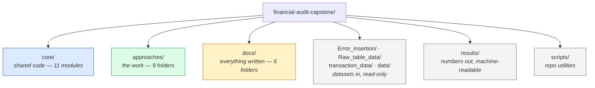
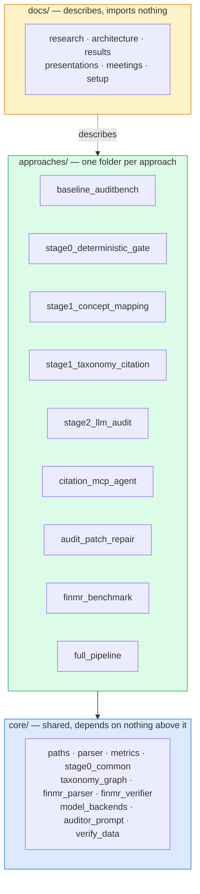
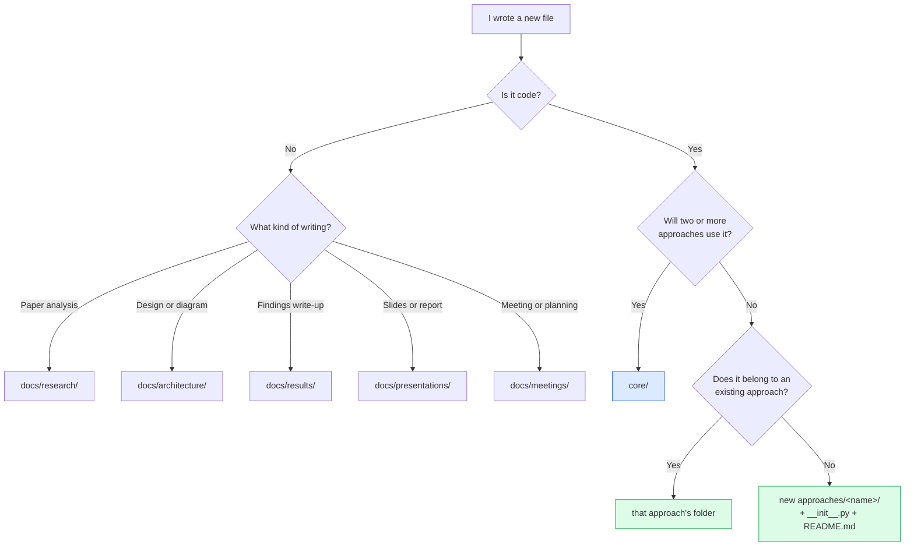
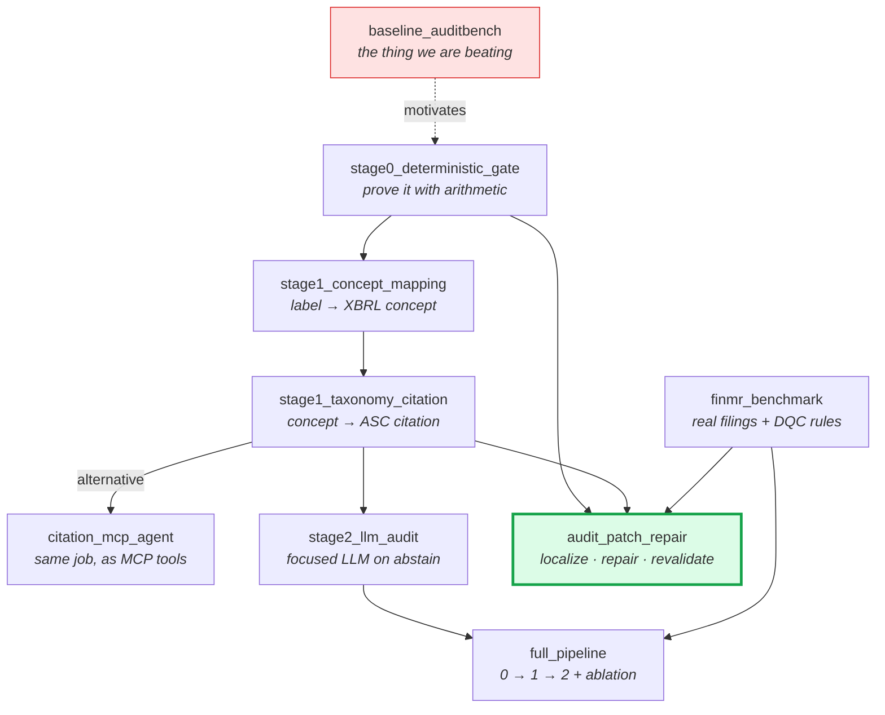
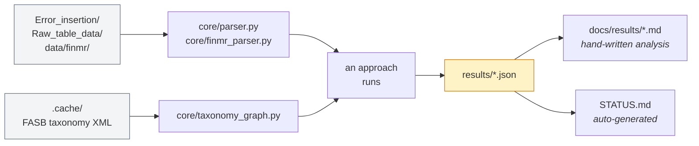

# How this repository is organised

This branch consolidates work that used to live across six separate branches. This
file explains the shape it landed in and, more importantly, *why* — so you know
where to put the next thing you write.

---

## The one-sentence version

**Shared code goes in `core/`, each distinct approach gets its own folder under
`approaches/`, and everything written goes in `docs/`.**

---

## The whole repository

At the top level there are also four files worth knowing:

| File | What it is |
|---|---|
| `README.md` | The front door — what the project is, headline results, quick start |
| `STATUS.md` | **Auto-generated.** Does each approach still run? Never hand-edit |
| `MATURITY.md` | Hand-written. How far each approach can be trusted |
| `requirements.txt` | One dependency list for everything |

---

## The three layers

Read this diagram top to bottom — it is the dependency direction, and it never
runs the other way.

**`core/` never imports from `approaches/`.** That is the one structural rule. If
you find yourself wanting to break it, the thing you are reaching for belongs in
`core/`.

Approaches *may* import each other, and that is fine — the import line documents
the dependency. When `audit_patch_repair` says
`from approaches.stage0_deterministic_gate import stage0a`, you can see the
relationship without reading a design doc.

---

## Where does a new file go?

---

## How the approaches connect

Not a strict chain — some were built as alternatives to each other.

`audit_patch_repair` is outlined because it is the current research direction and
where the headline result comes from. `baseline_auditbench` is red because it is
the control, not a contribution.

---

## How data flows through a run

Two things to keep straight:

- **`results/` versus `docs/results/`** — the first is JSON a script writes, the
  second is prose a human writes about that JSON.
- **`.cache/` is gitignored and self-healing.** The FASB taxonomy (~11 MB)
  downloads on first use. Delete it and it comes back.

---

## Why it is shaped this way

**Why `core/` instead of duplicating helpers into each approach?**
Six of the nine approaches parse AuditBench tables and four use the taxonomy
graph. Duplicating those would mean six copies drifting apart, and the results
would stop being comparable across approaches — which is the entire point of
having approaches side by side.

**Why folders per approach instead of one big package?**
Because the deliverable is a comparison. When a supervisor asks "what did you try
for citations?", the answer should be a folder you can point at, with a README
that states what it scored, rather than a set of files you have to identify by
name.

**Why no `01_`, `02_` number prefixes?**
Python identifiers cannot start with a digit — `approaches.01_baseline` will not
import. The ordering lives in the `stage0`/`stage1`/`stage2` prefixes and in
[`approaches/README.md`](approaches/README.md) instead.

**Why is everything run with `python -m` from the root?**
Because the root is then on `sys.path`, so `core` and `approaches` both resolve
with no setup. That is what let us delete every `sys.path.insert` hack during the
restructure. It also means **you must run from the repository root** — that is the
only real constraint the layout imposes.

**Why `core/paths.py` instead of `os.path.dirname(__file__)`?**
Modules sit at different depths, so anchoring paths to a file's own location
breaks the moment it moves. Roughly thirty of those broke during this restructure.
Everything now resolves through one module, and `RESULTS_DIR` is overridable via
`AUDIT_RESULTS_DIR` so a health check can write to scratch without overwriting
committed evidence.

---

## Every folder has a README

| Folder | README |
|---|---|
| Root | [README.md](README.md) |
| `core/` | [core/README.md](core/README.md) |
| `approaches/` | [approaches/README.md](approaches/README.md) — plus one inside each of the 9 |
| `docs/` | [docs/README.md](docs/README.md) — plus one inside each of the 6 |
| `results/` | [results/README.md](results/README.md) |
| `data/` | [data/README.md](data/README.md) |
| `scripts/` | [scripts/README.md](scripts/README.md) |

Each approach README answers the same four questions in the same order: what it
does, why it exists, how to run it, and what it scored.
