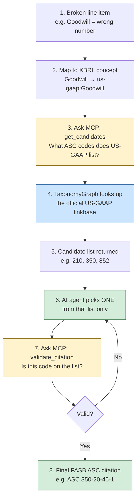
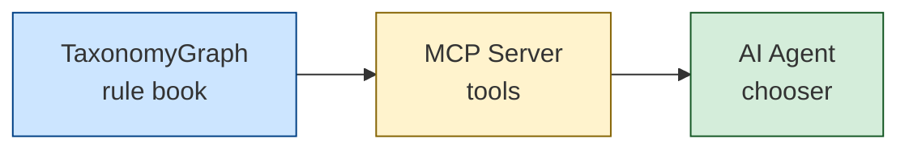

# How Citation Works (Simple Flow)

One pipeline. Same US-GAAP rule book. An AI agent picks the citation through MCP tools.

---

## The flow

---

## What each step means

| Step | What happens | Why it matters |
|------|----------------|----------------|
| **1. Broken line item** | Audit finds a bad row (from Stage 0). | We only cite the row that failed. |
| **2. Map to concept** | EDGAR mapper turns the label into a `us-gaap` name. | The rule book is keyed by concepts, not English labels. |
| **3. `get_candidates`** | Agent calls the MCP tool. | MCP is just the “USB port” to our tools — the agent cannot browse random websites. |
| **4. TaxonomyGraph** | Python loads FASB’s US-GAAP reference XML and finds every ASC linked to that concept. | This **is** the rule book. Not the LLM’s memory. |
| **5. Candidate list** | e.g. `[210, 350, 852]` for Goodwill. | Several codes can be “legal”; we must choose the right *kind*. |
| **6. Agent picks** | AI chooses one code **from the list** (subject-matter like 350 over presentation like 210). | AI = selector, not inventor. |
| **7. `validate_citation`** | MCP checks the pick is really in that list. | Blocks hallucinated ASC codes. |
| **8. Final citation** | Validated ASC goes into the audit output. | Grounded + chosen with context. |

If validate fails → go back to step 6 and try another candidate (max a few times).

---

## Three pieces (and only three)

1. **TaxonomyGraph** — FASB concept → ASC links (data).  
2. **MCP Server** — exposes that data as tools (`get_candidates`, `validate_citation`).  
3. **AI Agent** — calls tools, picks, retries until valid.

---

## Current vs this flow (one sentence)

- **Current:** TaxonomyGraph alone ranks links and emits **one** ASC — no agent, no retry.  
- **This flow:** same graph → **full list** via MCP → agent **picks + validates**.

---

## Tiny example

**Input:** concept `Goodwill`  

1. `get_candidates` → `210`, `350`, `852`…  
2. Agent picks `350-20-45-1` (goodwill standard).  
3. `validate_citation` → valid.  
4. Output: **FASB ASC 350-20-45-1**

If the agent invented `ASC 999` → validate fails → must pick again from the real list.

---

*Keep this page as the single walkthrough. Details live in code under `taxonomy_graph.py` and `citation_mcp/`.*
