# Taxonomy Graph & MCP Citation Flow

**IntelliAudit — how citations are grounded and queried**  
*Diagram-first brief for demos and design review*

---

## 1. Big picture

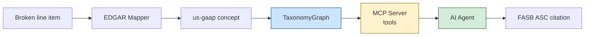

| Layer | Job |
|-------|-----|
| **TaxonomyGraph** | Read FASB’s US-GAAP XML; list ASC links for a concept |
| **MCP Server** | Expose that graph as tools an agent can call |
| **AI Agent** | Pick one ASC from tool results; never invent codes |

---

## 2. What the TaxonomyGraph is (internally)

FASB publishes a **US-GAAP taxonomy ZIP**. Inside it is a **reference linkbase** XML: edges from concepts → ASC reference elements.

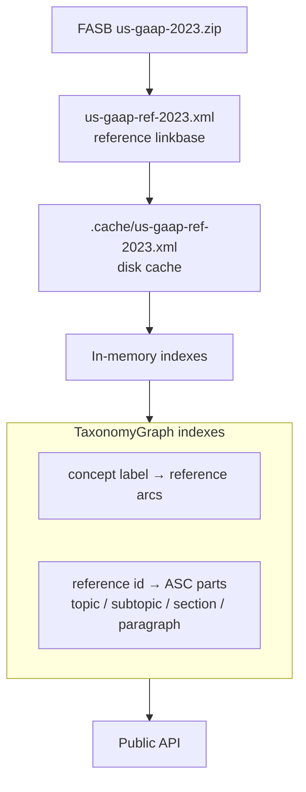

### Graph shape (conceptual)

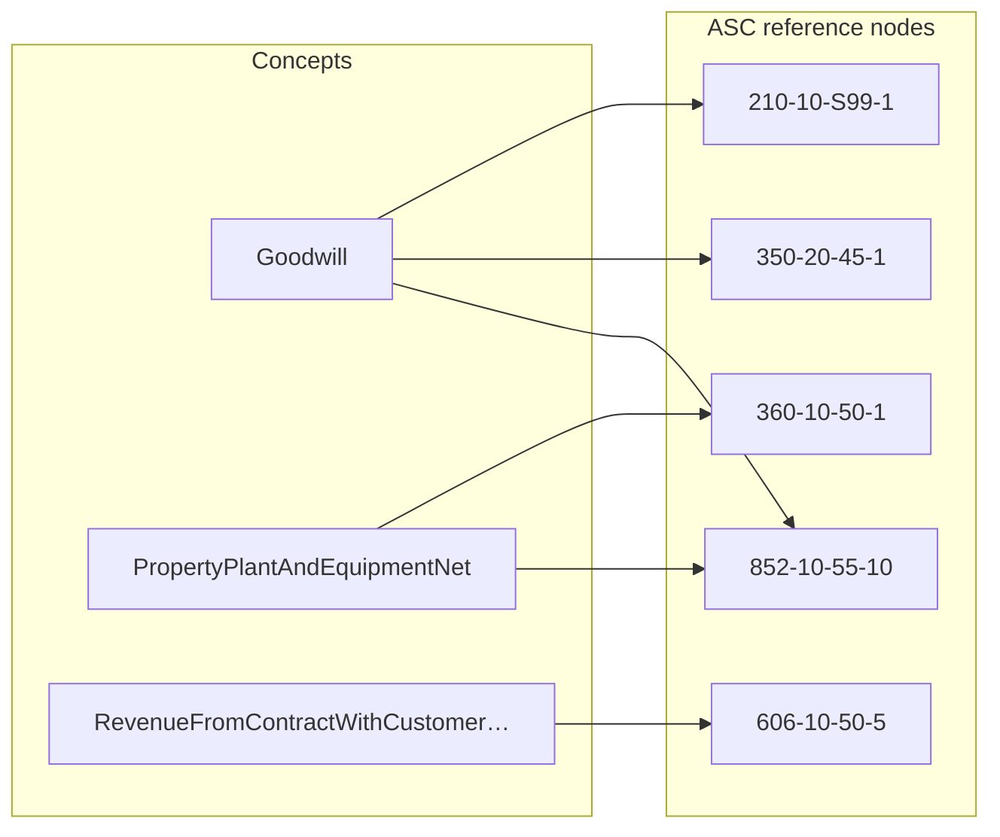

One concept → **many** ASC edges. That ambiguity is why a single automatic pick can be wrong.

---

## 3. How TaxonomyGraph answers a query (no MCP yet)

### Current Stage 1 path — single pick

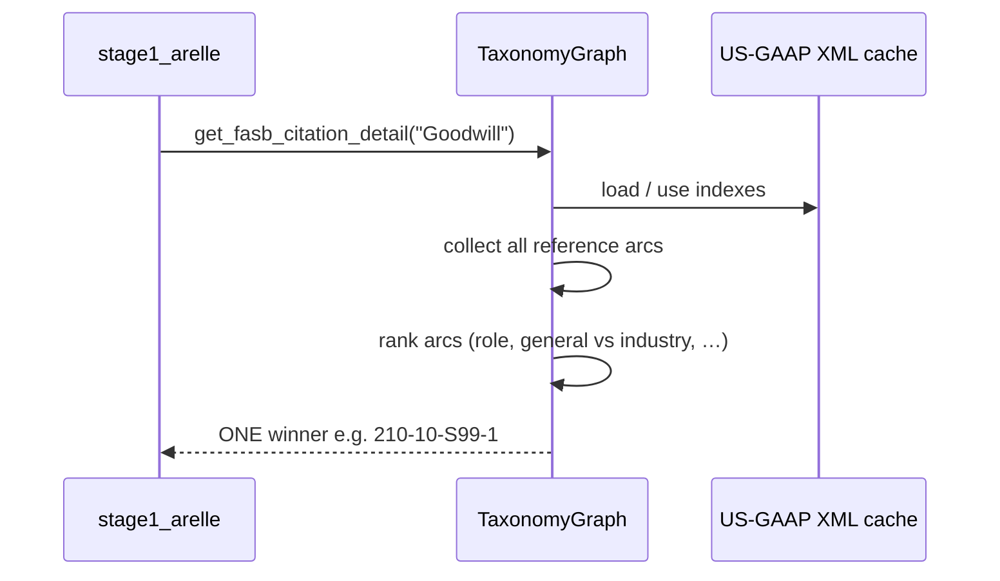

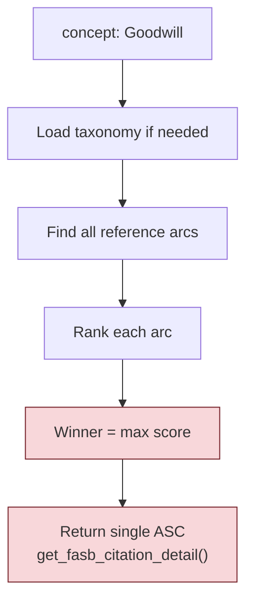

If the leaf concept has no arcs → **parent fallback** (strip CamelCase tokens and retry).

---

## 4. How the MCP server wraps the graph

We do **not** upload the XML into MCP. We wrap the **same Python object** behind tool functions.

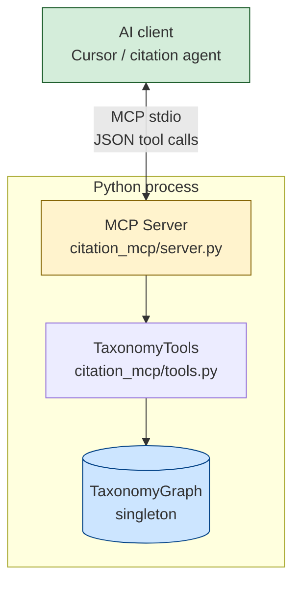

### Tool ↔ graph method map

| MCP tool | Calls on TaxonomyGraph | Returns |
|----------|------------------------|---------|
| `get_candidates(concept)` | `get_candidate_citations()` | **All** ASC links for the concept |
| `get_concept_info(concept)` | `get_fasb_citation_detail()` + candidates | Baseline single pick + topic split |
| `validate_citation(concept, asc)` | candidates again; membership check | `{valid: true/false}` |
| `store_pick(item_id, citation, …)` | (agent state only) | Saved final choice |

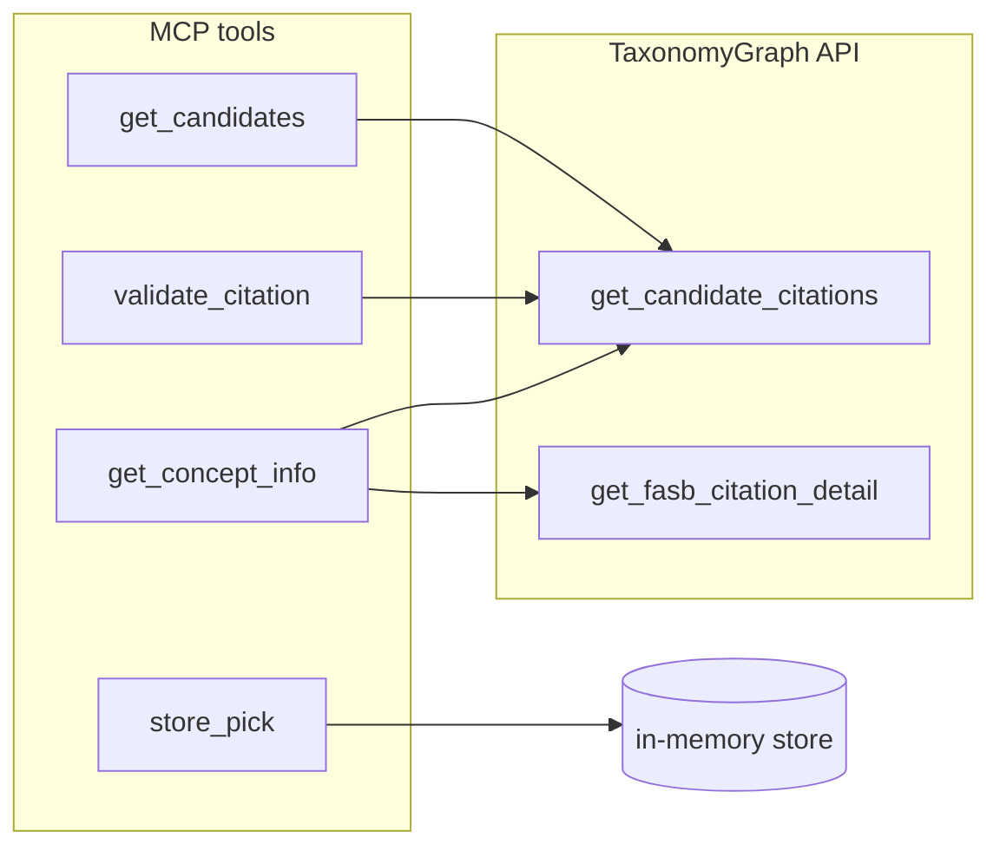

### Start the server

```bash
python -m citation_mcp.server
```

Cursor (or any MCP client) launches that process and calls tools over stdio.

---

## 5. How an AI agent queries citations (full loop)

This is the **proposed** citation path: agent + MCP + same graph.

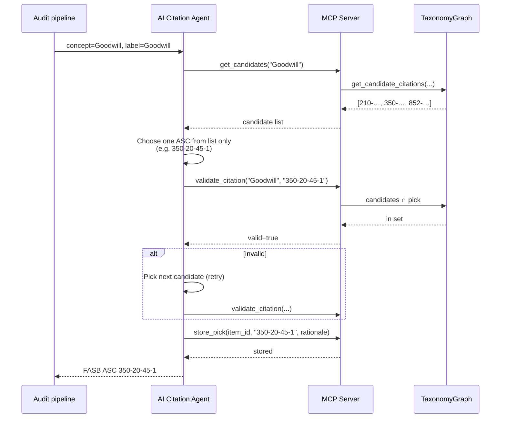

### Decision flow (agent view)

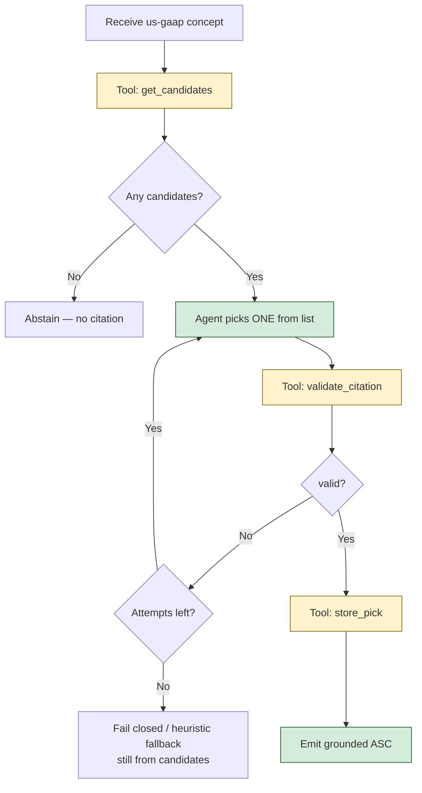

**Hard rule:** the agent never invents an ASC. If a code is not in `get_candidates`, `validate_citation` returns `valid=false`.

---

## 6. Current vs proposed (citation step only)

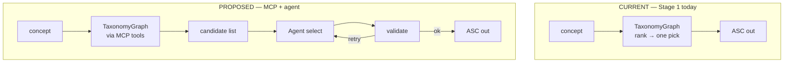

Same rule book (US-GAAP XML). Different decision process.

---

## 7. Example walkthrough: Goodwill

| Step | Who | What happens |
|------|-----|----------------|
| 0 | Mapper | Row “Goodwill” → concept `Goodwill` |
| 1 | Agent → MCP | `get_candidates("Goodwill")` |
| 2 | Graph | Returns e.g. `210`, `350`, `852`, `942`… |
| 3 | Agent | Prefers subject-matter → picks `350-20-45-1` |
| 4 | Agent → MCP | `validate_citation("Goodwill", "350-20-45-1")` → **valid** |
| 5 | Agent → MCP | `store_pick(...)` |
| 6 | Pipeline | Uses `FASB ASC 350-20-45-1` |

If the agent had guessed `ASC 330-10-35-1` (inventory) → validate **fails** → must retry from the real list.

---

## 8. Where this sits in the full audit

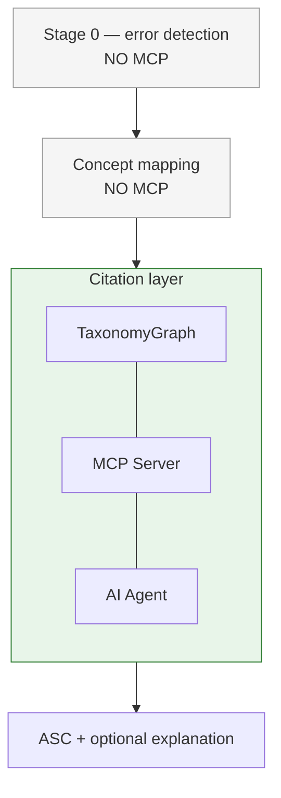

**MCP is only on citation.** Math checks and mapping stay outside.

---

## 9. File map

| File | Role |
|------|------|
| `taxonomy_graph.py` | Load XML, index arcs, single pick + candidate list |
| `citation_mcp/tools.py` | Thin wrappers over the graph |
| `citation_mcp/server.py` | MCP server (`@server.tool` → tools) |
| `citation_mcp/agent.py` | Iterative agent (heuristic / LLM) |
| `stage1_arelle.py` | Current production path: single pick only |

---

## 10. One-line summary

> **TaxonomyGraph** = FASB’s concept→ASC rule book in memory.  
> **MCP server** = USB port that exposes that book as tools.  
> **AI agent** = reads the tool menu, picks one ASC, and must pass validate before the citation counts.

---

*TAXONOMY_MCP_FLOW.md · IntelliAudit*
