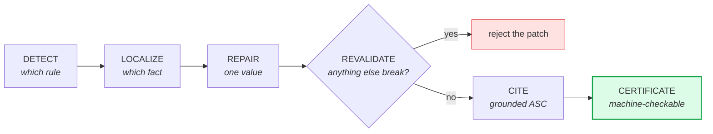

# AuditPatch — detect, localize, repair, revalidate, certify

**The current research direction, and where the headline result comes from.**



Existing work asks *is this filing wrong?* AuditPatch asks the next question:
*which number caused it, what is the smallest correct fix, and can we prove the
fix broke nothing else?*

Detection tells an auditor there is a problem. A verified repair tells them what
to do about it.

## The loop

```
DETECT      which rule is violated
   ↓
LOCALIZE    which single fact caused the violation
   ↓
REPAIR      the smallest change that satisfies the rule (exactly one value)
   ↓
REVALIDATE  re-run every check; reject the patch if anything new breaks
   ↓
CITE        attach a taxonomy-grounded ASC citation
   ↓
CERTIFY     emit a machine-checkable certificate of the whole trace
```

The governing rule: **anything may propose, only the checks may accept.** A patch
is accepted only if it removes the original violation, changes exactly one value,
and introduces no new violation anywhere. Fail any one and it is discarded.

## Why the certificate matters

Every accepted repair emits a structured record containing the rule that fired, the
equation in plain terms, the concept and period of the offending fact, its reported
value, the corrected value, the revalidation outcome, and the citation. A reviewer
can check each line by hand. Nothing is hidden inside a model — which is the whole
point of the explainability deliverable.

## Files

| File | Purpose |
|---|---|
| `pipeline.py` | V0 loop over AuditBench-style text tables |
| `patch.py` | Typed minimal patches (`replace_fact_value`) and value formatting |
| `finmr_repair.py` | The real pipeline: FinMR records, DQC rules, certificates |
| `run_v0.py` | Evaluation on AuditBench `single_error` |
| `run_finmr.py` | Evaluation on FinMR — this produces the headline numbers |

## Run it

```bash
# prototype loop on AuditBench synthetic errors
python -m approaches.audit_patch_repair.run_v0 --n 80

# the real evaluation on 332 real SEC filings
python -m approaches.audit_patch_repair.run_finmr --n 40    # quick
python -m approaches.audit_patch_repair.run_finmr           # all 332
```

No API key required. The entire pipeline is deterministic — there is no LLM in the
numerical repair path, deliberately, so the numbers are reproducible and nothing
can be attributed to model behaviour.

## Results — 332 real SEC filings

From `results/audit_patch_finmr_332.json`:

| Measure | Result |
|---|---|
| Records | 332 |
| Repairs proposed | 178 |
| **Exact match against DQC ground truth** | **145 (81.5%)** |
| **Repairs that broke something else** | **0** |
| Values changed per repair | 1 |
| Repairs with a verified citation | 166 (93.3%) |

The zero matters as much as the 81.5%. Every accepted fix left the rest of the
filing valid.

### Per-rule breakdown

| DQC rule | What it checks | n | Patched | Exact |
|---|---|---|---|---|
| `DQC_US_0126` | Calculation-tree consistency | 102 | 86 | 83 (**96.5%**) |
| `DQC_US_0015` | Sign consistency (must not be negative) | 110 | 59 | 50 (**84.7%**) |
| `DQC_US_0117` | Dimensional aggregation | 120 | 33 | 12 (**36.4%**) |

Strong where the fix is arithmetic: recompute a total from its parts, or flip a
sign the rule forbids. Weak on dimensional aggregation, where we must solve
backwards for a missing piece from a total and its other components — and when the
dataset only includes part of the filing, that value is not recoverable. We report
it rather than hiding it.

## Abstention

Where the evidence does not determine an answer, the pipeline says so instead of
guessing. That is why 178 repairs were proposed for 332 records, and why the 81.5%
is measured only on cases where ground truth is actually determinable.

## Where the LLM fits

Nowhere in the numbers above — by design. The intended role is the step *after*
certification: turning a proven certificate into a paragraph an auditor can read.
See [docs/presentations/PRESENTATION.md](../../docs/presentations/PRESENTATION.md)
slides 10–15, and the tool-locking evidence in
[`citation_mcp_agent`](../citation_mcp_agent/).

Full write-up: [docs/results/FINMR_RESULTS.md](../../docs/results/FINMR_RESULTS.md).
