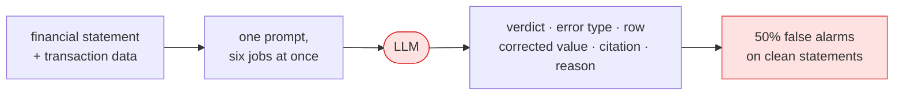

# Baseline — AuditBench replication

**Stage 0 of the story: the thing we are trying to beat.**



Reproduces the setup from *Automating Financial Statement Audits with Large
Language Models* ([arXiv:2506.17282](https://arxiv.org/abs/2506.17282)): hand an
LLM a financial statement, its supporting transaction data, and one prompt asking
it to do the whole audit at once — decide whether the statement is wrong, classify
the error type, locate the row, give the corrected value, cite the governing
accounting standard, and explain itself.

## Why it exists

It is the control condition. Every later approach is measured against it, and its
failure pattern is what motivates the whole project: the model is competent at
noticing that something is off, and unreliable at the two things an auditor
actually needs — the exact numeric correction and a real citation. Asking one
prompt to do six jobs is the design flaw we decompose in later stages.

## Files

| File | Purpose |
|---|---|
| `main.py` | CLI entry point; runs a split against a model and scores it |
| `runner.py` | Prompt dispatch, JSON extraction, resumable per-item runs |
| `evaluate.py` | Scores a predictions file, prints the comparison table |

The prompt itself is `core/auditor_prompt.py`, kept verbatim from the paper so the
comparison stays honest. LLM clients come from `core/model_backends.py`.

## Run it

```bash
# score an existing predictions file (no API key needed)
python -m approaches.baseline_auditbench.evaluate

# full run against a model
python -m approaches.baseline_auditbench.main --model claude/claude-haiku-4-5 \
    --split single_error --n 150

# free dry run: exercises the plumbing without any API calls
python -m approaches.baseline_auditbench.main --dry-run --n 10
```

Splits are `correct`, `single_error` and `multi_error`. Runs are resumable —
re-running skips items already present in the output file.

## What it scores

The stored Claude Opus 4.6 baseline over n=150 per split is in
`results/claude-opus-4-6_*_predictions.json`. The number that matters most:

**On clean statements it raises a false alarm 50% of the time.** Half the
statements with nothing wrong get reported as containing an error. That single
figure is the strongest argument for putting a deterministic gate in front of the
model — see [`stage0_deterministic_gate`](../stage0_deterministic_gate/) and the
ablation in [`full_pipeline`](../full_pipeline/).

## Note on two runners

`runner.py` here is the current baseline runner and goes through
`core.model_backends`. A fuller earlier version with its own provider detection
and client construction lives at
`approaches/full_pipeline/intelliaudit_runner.py`, because the IntelliAudit
pipeline and Stage 2 were built against it. They are kept separate rather than
merged so neither line of results shifts.
