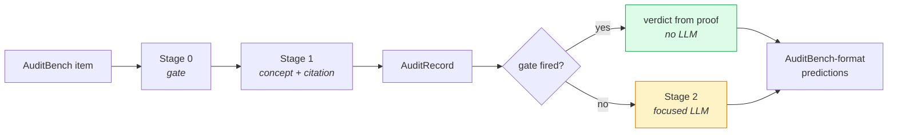

# Full pipeline — IntelliAudit end to end

**Stage 0 → Stage 1 → Stage 2 wired together, plus the ablation that measures what
the deterministic architecture actually buys you.**



## The integration

For one AuditBench item:

```
Stage 0A (arithmetic) + Stage 0B (identity)  →  combine findings  →  verdict
EDGAR mapper + Stage 1 taxonomy              →  broken-row citation + candidates
```

producing one structured `AuditRecord` carrying everything downstream needs: the
deterministic judgment, the localized error and its corrected value, the grounded
citation candidate set, and the positive *verified-consistent* signal.

Then the routing decision:

- **Gate fires** — build the verdict from the proof with no LLM at all. Type, row
  and corrected value come from the finding; the citation comes from Stage 1.
- **Gate abstains** — call [`stage2_llm_audit`](../stage2_llm_audit/) with the
  verified-consistent flag and per-row candidate citations attached.

Output is written in AuditBench prediction format so `evaluate.py` can score it
head-to-head against the LLM-alone baseline.

## Files

| File | Purpose |
|---|---|
| `pipeline.py` | Stage 0 → 1 integration, emits `AuditRecord` |
| `run_intelliaudit.py` | Full run, emits AuditBench-format predictions (resumable) |
| `pipeline_eval.py` | The ablation harness |
| `run_audit.py` | Combined runner across AuditBench and FinMR paths |
| `intelliaudit_runner.py` | The runner Stage 2 and `run_intelliaudit` were built against |

## Run it

```bash
# the ablation — no API calls, reuses stored predictions
python -m approaches.full_pipeline.pipeline_eval

# full pipeline run (needs an API key for the Stage 2 path)
python -m approaches.full_pipeline.run_intelliaudit --model claude/claude-haiku-4-5 --n 150

python -m approaches.full_pipeline.run_audit --n 150
```

## The ablation

`pipeline_eval.py` answers one question: **at a fixed model, what does the
deterministic architecture add?** Three configurations over n=150 per split,
reusing the stored Claude Opus 4.6 predictions so no new API calls are needed:

- **Config A** — LLM alone (the baseline's verdict)
- **Config B** — Stage 0 alone as sole judge (fires on proof, abstains otherwise)
- **Config A+veto** — LLM verdict, but overridden when it claims an error on a
  statement the deterministic gate proved consistent

### Results

**Clean statements — the false-alarm problem:**

| Config | General judgment correct |
|---|---|
| A — LLM alone | 50.0% |
| B — Stage 0 alone | **100.0%** |
| A+veto — LLM with deterministic veto | 71.3% |

The false-positive rate drops from **50% to 28.7%** — 32 of 75 false alarms vetoed
by arithmetic the model should not have overruled.

**Error splits:**

| Split | Gate fire rate | LLM alone | Stage 0 alone | Type EM when fired | Row EM when fired |
|---|---|---|---|---|---|
| `single_error` | 38.0% | 97.3% | 38.0% | **94.7%** | **89.5%** |
| `multi_error` | 36.0% | 99.3% | 36.0% | 74.1% | 70.4% |

Read together, the two tables are the argument for the hybrid. The LLM is
excellent at noticing that *something* is wrong (97–99%) and terrible at staying
quiet when nothing is (50%). The gate is the mirror image: it stays silent on most
errors but is near-perfect when it speaks, and never fires falsely. Neither alone
is an auditor. Gating one with the other is.

A secondary benefit: the gate fires on 36–38% of items, so those never reach the
model at all — a direct reduction in API cost.

Full write-up: [docs/results/pipeline_eval_n150.md](../../docs/results/pipeline_eval_n150.md).

## Note on two runners

`intelliaudit_runner.py` is a fuller runner with its own provider detection,
client construction and table hashing. The baseline's `runner.py` is a later,
slimmer version built on `core.model_backends`. Both are kept: Stage 2 and
`run_intelliaudit` depend on the former, and merging them would shift results that
have already been reported.
