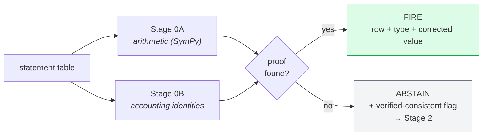

# Stage 0 — Deterministic gate

**Catch everything arithmetic alone can prove, before any LLM runs.**



Two independent verifiers run over a statement with no model involved:

- **Stage 0A** — arithmetic verification with exact symbolic maths (SymPy). Does
  each subtotal equal the sum of the rows under it? Does the statement foot?
- **Stage 0B** — accounting identity verification. Assets = Liabilities + Equity,
  and the other structural equations that must hold regardless of company.

If either produces a proof, the gate **fires**: it reports the error, names the
row, and gives the corrected value. If neither can prove anything, the gate
**abstains** and hands the item to the LLM stage with its findings attached.

## Why it exists

The baseline's worst failure is over-auditing: 50% false alarms on clean
statements. A verifier that can only speak when it has a proof is immune to that
failure by construction. It also gives the downstream LLM something the baseline
never had — a positive *verified-consistent* signal meaning "the maths already
checks out, do not go looking for a numerical error."

The design principle, inherited from AuditFlow
([arXiv:2606.03031](https://arxiv.org/abs/2606.03031)): let the model guide the
search, let a symbolic environment do the verification.

## Files

| File | Purpose |
|---|---|
| `stage0a.py` | Arithmetic and subtotal footing checks (SymPy) |
| `stage0b.py` | Accounting identity checks |
| `stage0_eval.py` | Evaluation over AuditBench splits |

`Finding`, table construction and label normalization are shared, so they live in
`core/stage0_common.py`.

## Run it

```bash
python -m approaches.stage0_deterministic_gate.stage0_eval --n 150
```

No API key required — this approach never calls a model.

## What it scores

From `results/stage0_eval.json` at n=150 per split:

| Metric | Result |
|---|---|
| False-positive rate on the clean split | **0.0%** |
| Error-type exact match when it fires | **94.7%** |
| Error-row exact match when it fires | **89.5%** |
| Fire rate on `single_error` | 38% |

Read that as a deliberate trade. It stays silent on roughly 62% of real errors,
but when it does speak it is almost always right and it never invents a problem.
Coverage is the LLM stage's job; precision is this one's.
