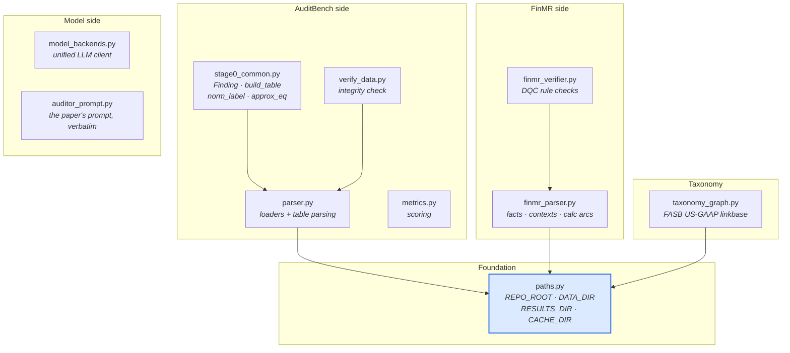

# `core/` — shared building blocks

Code used by **two or more** approaches. That is the entire admission rule. If
only one approach needs it, it belongs in that approach's folder instead.

**`core/` never imports from `approaches/`.** Dependencies point one way only. If
you need to break that rule, the thing you are reaching for belongs here.

---

## What is in here



| Module | Purpose | Used by |
|---|---|---|
| `paths.py` | Single source of truth for every on-disk location | everything |
| `parser.py` | AuditBench loaders (`load_correct`, `load_single_error`, `load_multi_error`) and table parsing | 6 approaches |
| `stage0_common.py` | `Finding`, `build_table`, `norm_label`, `approx_eq` | 3 approaches |
| `metrics.py` | Scoring functions shared across evaluations | 2 approaches |
| `taxonomy_graph.py` | Downloads and indexes the FASB US-GAAP 2023 reference linkbase | 4 approaches |
| `finmr_parser.py` | FinMR record → XBRL facts, contexts, calculation arcs | 4 approaches |
| `finmr_verifier.py` | The three DQC rule checks | 3 approaches |
| `model_backends.py` | One LLM client interface across Anthropic / OpenAI / local | 2 approaches |
| `auditor_prompt.py` | AuditBench's prompt, unchanged, so comparisons stay fair | baseline |
| `verify_data.py` | Confirms the datasets are intact before a long run | standalone |

---

## `paths.py` deserves a note

Every other module resolves directories through it rather than computing them
from its own `__file__`:

```python
from core.paths import REPO_ROOT, DATA_DIR, RESULTS_DIR, CACHE_DIR
```

This is not ceremony. Modules sit at different depths, so `os.path.dirname(__file__)`
means "wherever I happen to live" — and about thirty of those broke the moment
files moved during the restructure. `core/parser.py` started hunting for
`core/Error_insertion/`, and the taxonomy cache pointed at `core/.cache/`.

`RESULTS_DIR` also honours an `AUDIT_RESULTS_DIR` environment variable, which is
how `scripts/status.py` runs every approach without overwriting the committed
evidence in `results/`.

---

## `taxonomy_graph.py` and the cache

First use downloads the FASB US-GAAP 2023 taxonomy (~11 MB) and extracts the
reference linkbase to `.cache/us-gaap-ref-2023.xml`. Later runs read from disk, so
only the first call needs network. The cache is gitignored and self-healing —
delete it and it comes back.

This module is what makes citation a *lookup* rather than *recall*. Nothing built
on it can produce an ASC citation that does not exist.

---

## Two parsers, on purpose

`parser.py` handles AuditBench's text tables. `finmr_parser.py` handles FinMR's
XBRL instances. They are unrelated formats — one is `[row 3]: Revenue | 1,284`,
the other is a tagged XML document with contexts and calculation arcs — so
merging them would help nobody.

---

## Run the integrity check

```bash
python -m core.verify_data
```

Confirms both datasets parse and the error-type splits are balanced. Worth running
before any long evaluation.
