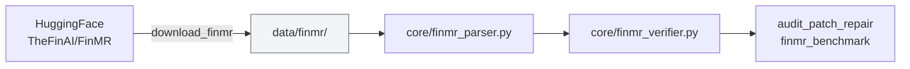

# `data/` — downloaded datasets

Datasets fetched at runtime. **Nothing here is committed** beyond this file and
small index files — the blobs are gitignored and re-downloadable.

The AuditBench data is *not* here. It ships with the repo at the root, in
`Error_insertion/`, `Raw_table_data/` and `transaction_data/`, in the layout the
benchmark publishes.



---

## `data/finmr/`

FinMR is the mathematical-reasoning task of FinAuditing
([arXiv:2510.08886](https://arxiv.org/abs/2510.08886)): **332 test items built
from real SEC XBRL filings**, with violations labeled by official DQC (Data
Quality Committee) rules.

| File | Size | Committed? |
|---|---|---|
| `test.jsonl` | ~38 MB | No — gitignored |
| `finmr_test.parquet` | ~5 MB | No — gitignored |
| `summary.json` | small | Yes |
| `README.md` | small | Yes |

Fetch it:

```bash
python -m approaches.finmr_benchmark.download_finmr
```

---

## Why this dataset matters

AuditBench errors are *injected*, so the ground truth is perfect but synthetic — a
system could learn the injection pattern rather than the accounting. FinMR errors
are real, and the labels come from published validation rules that actual filers
are checked against.

The decisive property is that FinMR gives **root-cause** ground truth, not a
pass/fail label:

```json
{"extracted_value": "-1284", "calculated_value": "1284"}
```

The value the filing reported, and the value the calculation relationships imply.
That names the offending fact *and* the correct answer, which is what makes exact
repair scoring possible with no judge model in the loop. It is the reason the
81.5% figure means something.

## Three rule families

| Rule | Checks | Items |
|---|---|---|
| `DQC_US_0015` | Sign consistency — element must not be negative | 110 |
| `DQC_US_0117` | Dimensional aggregation | 120 |
| `DQC_US_0126` | Calculation-tree consistency | 102 |

The same three AuditFlow evaluates on, which keeps our numbers comparable.

## Size warning

Each FinMR item stuffs an entire XBRL instance into one prompt — 17k to 167k
characters. A full 332-item LLM run is genuinely expensive, which is why
`eval_finmr.py` samples and truncates by default and reports an `answerable%`
diagnostic so you can tell truncation from a real failure.

## Also gitignored

`.cache/` at the repo root holds the FASB US-GAAP taxonomy (~11 MB), downloaded
on first use by `core/taxonomy_graph.py`. Same idea: delete it and it comes back.
