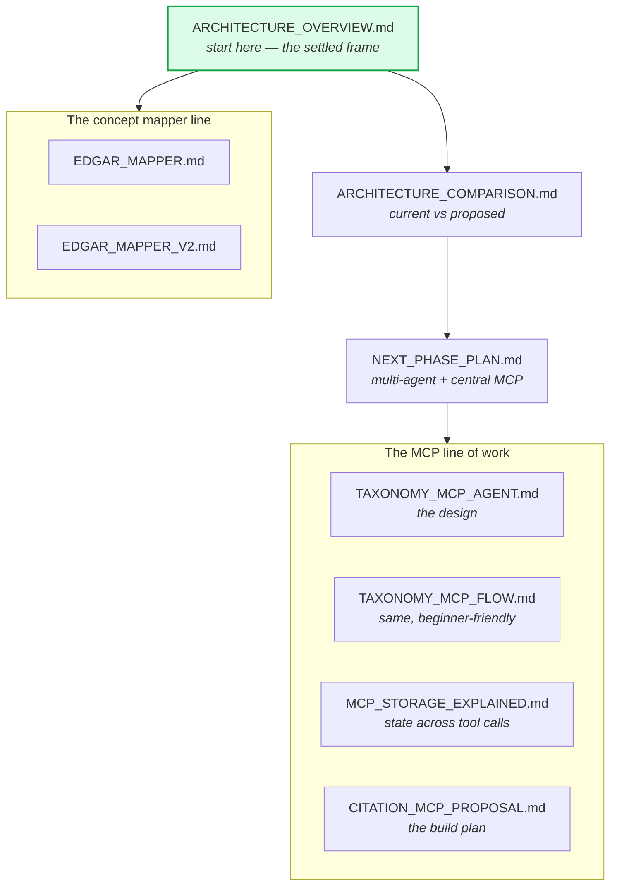

# `docs/architecture/` — design documents

How the system is put together, and the design history behind it. Nine documents,
written at different points, so a few describe designs that were later superseded
— noted below where that is true.

---

## Start here

| Document | What it gives you |
|---|---|
| [ARCHITECTURE_OVERVIEW.md](ARCHITECTURE_OVERVIEW.md) | **The short deck.** The six-stage architecture we have settled on, and which parts are still moving. Read this first |
| [ARCHITECTURE_COMPARISON.md](ARCHITECTURE_COMPARISON.md) | Current versus proposed, diagram-led, built for slides |

The central idea in both: **the frame is fixed, the methods inside each stage are
not.** We are confident about the six stages — detect, localize, repair,
revalidate, cite, explain — and still actively changing how citation and
explanation are done inside them.

## The MCP line of work

| Document | What it covers |
|---|---|
| [NEXT_PHASE_PLAN.md](NEXT_PHASE_PLAN.md) | Multi-agent design with a central MCP server holding verified evidence |
| [TAXONOMY_MCP_AGENT.md](TAXONOMY_MCP_AGENT.md) | Design of the taxonomy knowledge agent and its tool surface |
| [TAXONOMY_MCP_FLOW.md](TAXONOMY_MCP_FLOW.md) | The same thing as a single walkthrough, assuming no background |
| [MCP_STORAGE_EXPLAINED.md](MCP_STORAGE_EXPLAINED.md) | How state is shared across MCP tool calls |
| [CITATION_MCP_PROPOSAL.md](CITATION_MCP_PROPOSAL.md) | The original proposal and build plan for the citation server |

What was actually built from these is
[`approaches/citation_mcp_agent/`](../../approaches/citation_mcp_agent/). Read the
proposal alongside that folder's README — the README carries the measured outcome,
including the finding that tool-locking eliminated hallucination without improving
accuracy.

## The concept mapper line

| Document | What it covers |
|---|---|
| [EDGAR_MAPPER.md](EDGAR_MAPPER.md) | Stage 1 concept mapper: pipeline, files, evaluation |
| [EDGAR_MAPPER_V2.md](EDGAR_MAPPER_V2.md) | Second iteration — period parsing, statement-type inference |

Built as [`approaches/stage1_concept_mapping/`](../../approaches/stage1_concept_mapping/).

---

## A caution on reading these

These were written as the project developed, and some describe intentions rather
than what shipped. `NEXT_PHASE_PLAN.md` in particular sketches a multi-agent
system that is only partly built.

**When a design doc and a folder README disagree, the folder README is right** —
those were written after the results came in and state what was actually measured.
