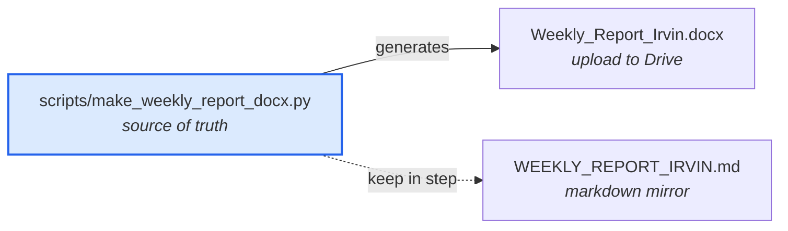

# `docs/meetings/` — meetings, reports and planning

The project record: what was discussed when, and what each of us did.



| Document | What it is |
|---|---|
| [WEEKLY_REPORT_IRVIN.md](WEEKLY_REPORT_IRVIN.md) | Weekly progress log with commit links, May–Aug 2026 |
| `Weekly_Report_Irvin.docx` | Same content as a Word file, for Drive → "Open with Google Docs" |
| [MEETING_NOTES_JULY2026.md](MEETING_NOTES_JULY2026.md) | July meeting notes |
| [MEETING_BRIEF_2026-06-26.md](MEETING_BRIEF_2026-06-26.md) | Brief prepared for the June 26 meeting |
| [MEETING_REPORT_2026-07-17.md](MEETING_REPORT_2026-07-17.md) | Report for the July 17 meeting |
| [todo.md](todo.md) | Team roadmap and task list |

---

## Editing the weekly report

**Do not edit the `.docx` directly.** It is generated, and the next run will
overwrite you. Edit the `MONTHS` list in
[`scripts/make_weekly_report_docx.py`](../../scripts/make_weekly_report_docx.py)
and regenerate:

```bash
python scripts/make_weekly_report_docx.py
```

Then update [WEEKLY_REPORT_IRVIN.md](WEEKLY_REPORT_IRVIN.md) to match, since it is
a mirror rather than a second source.

Columns follow the format the team agreed: Week / Meeting Date / Meeting minutes /
Description of work done during the week. Commit SHAs render as clickable links —
use `c("abc1234")` in a bullet list to emit one.

## Known gaps

Four rows were reconstructed from context rather than evidence and should be
confirmed before the report is submitted: **May 22, May 29, Jun 12, Jun 19**. No
commits exist before Jun 24, so those weeks were inferred from what was being
discussed at the time.

The Allison meeting dates are also missing — the source document they were drawn
from never names them.
