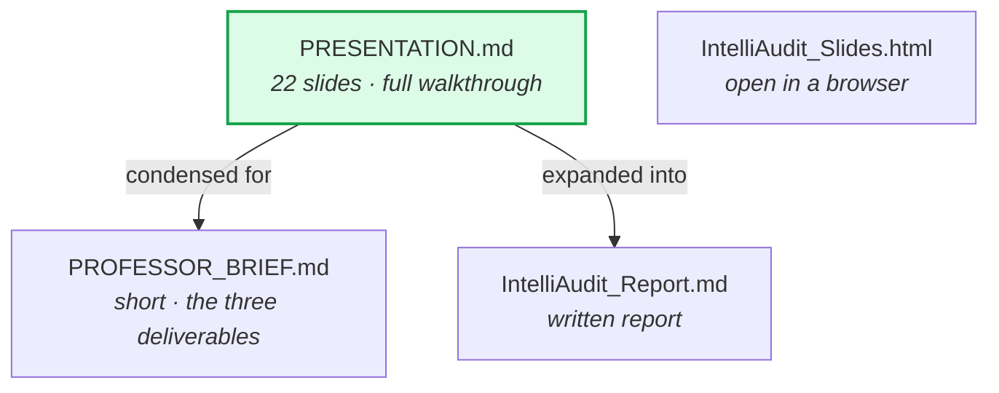

# `docs/presentations/` — slides and reports

Material written for an audience rather than for the repo.

| Document | Audience | Length |
|---|---|---|
| [PRESENTATION.md](PRESENTATION.md) | Anyone, assumes no accounting or AI background | 22 slides |
| [PROFESSOR_BRIEF.md](PROFESSOR_BRIEF.md) | Supervisor — the three deliverables | Short |
| [IntelliAudit_Report.md](IntelliAudit_Report.md) | Written project report | Long |
| [IntelliAudit_Slides.html](IntelliAudit_Slides.html) | Self-contained deck | Open in a browser |

---

## `PRESENTATION.md` is the main one

A full walkthrough that starts from "what is a financial statement" and ends at
the results. Diagrams are Mermaid, so they render on GitHub directly.

Its spine:

1. **Slides 1–9** — the problem, the pipeline, and why each stage is deliberately
   boring. Boring means checkable.
2. **Slides 10–15** — where the AI fits. The calculator decides, the AI narrates.
   Includes the tool-locking experiment and, importantly, its **negative result**:
   zero invented citations but no accuracy gain.
3. **Slides 16–22** — results, where the system is strong and weak, abstention,
   the safety rule, and what is next.

The line the whole deck is built around:

> **Anything may propose. Only the checks may accept.**

## On the experiment slides

Slides 13–15 report a real run, not a hypothetical, and they keep the unflattering
finding: accuracy stayed flat at 19.0% against a 26.2% ceiling, which means the
bottleneck is taxonomy coverage rather than the model. Leave that in. It is what
justifies using the LLM to explain a verified decision instead of to make one, and
a negative result you can explain is stronger than a positive one you cannot.

## Keeping numbers honest

Everything quoted traces to a file in [`results/`](../../results/). If you update
a number here, update it there too — and never take figures from
[STATUS.md](../../STATUS.md), which is small-sample by design.
