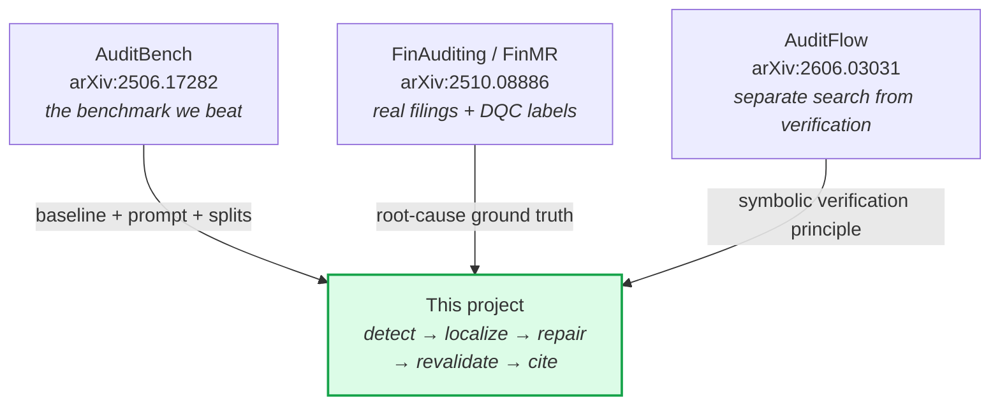

# `docs/research/` — papers and related work

Where our approach sits relative to published work, and what we borrowed from
each.

| Document | What it covers |
|---|---|
| [RESEARCH_ANALYSIS.md](RESEARCH_ANALYSIS.md) | The three-paper comparison, our approach against each, and an honest gap analysis of our own architecture |
| [FINMR_AUCKLAND_ANALYSIS.md](FINMR_AUCKLAND_ANALYSIS.md) | Why FinMR's DQC labels give root-cause ground truth, and how that differs from pass/fail detection labels |

---

## What we took from each

**AuditBench** gives the benchmark, the splits and the prompt. We keep the prompt
verbatim in `core/auditor_prompt.py` so every comparison is legitimate. Its
weakness is that the errors are injected, so ground truth is perfect but
synthetic.

**FinAuditing / FinMR** gives 332 real SEC filings labeled by official DQC rules.
Crucially it provides *root-cause* ground truth — the reported value and the
calculated value — which is the only reason exact repair scoring is possible.

**AuditFlow** gives the principle the whole architecture rests on: let the model
guide the search, let a symbolic environment do the verification. Our version of
it is "anything may propose, only the checks may accept."

---

## Also reviewed, not used

| Work | Why not |
|---|---|
| **AuditWen** ([2410.10873](https://arxiv.org/abs/2410.10873)) | Chinese government auditing, scraped text, labels generated by GPT-4. Different jurisdiction, different task, and the ground truth is model-generated |
| **FinLoRA** ([2505.19819](https://arxiv.org/abs/2505.19819)) | Fine-tunes on XBRL, but for tagging and extraction rather than error detection |
| **RKEFino1** ([2506.05700](https://arxiv.org/abs/2506.05700)) | Regulatory knowledge-enhanced, again extraction rather than repair |
| **FinTag** | XBRL tagging only |
| **XBRL-Agent** (ICAIF 2024) | **The closest precedent, and worth citing.** Adds a retriever and calculator to a base model instead of retraining — the same tool-grounding argument we make. It still only reads filings |

The gap is consistent across all of them: **everything published reads filings.
None localize a root cause, propose a minimal repair, or revalidate it.** That is
the niche this project occupies.
