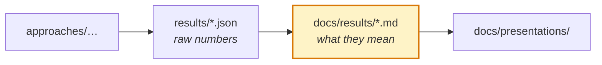

# `docs/results/` — findings, written up

Hand-written analysis of what the numbers mean. The numbers themselves are JSON
in [`results/`](../../results/) at the repo root.

---

| Document | Covers | Headline |
|---|---|---|
| [FINMR_RESULTS.md](FINMR_RESULTS.md) | AuditPatch on 332 real SEC filings | **81.5% exact repair, 0 regressions** |
| [FINMR_ALL_STAGES.md](FINMR_ALL_STAGES.md) | FinMR through every applicable stage | What applies, pass rates, per-approach metrics |
| [pipeline_eval_n150.md](pipeline_eval_n150.md) | What the deterministic gate adds at a fixed model | **False alarms 50% → 28.7%** |
| [stage2_comparison.md](stage2_comparison.md) | Focused Stage 2 LLM against the baseline prompt | |
| [priorities_2-4_results.md](priorities_2-4_results.md) | Results across the mid-project priorities | |
| [finmr_manual_review.md](finmr_manual_review.md) | Hand review of FinMR items and label quality | Labels held up |

---

## The two results to lead with

**AuditPatch on FinMR.** 81.5% exact repair against official DQC ground truth,
with zero regressions — every accepted fix left the rest of the filing valid.
Fully deterministic, so it reproduces exactly without an API key. Quote it with
its caveat: repairs are proposed on 178 of 332 records and the percentage is
measured on those; it abstains elsewhere rather than guessing.

**The ablation.** False alarms drop from 50% to 28.7% at a *fixed* model. This is
the cleanest evidence that the architecture rather than the model is doing the
work, and it runs with no API calls because it reuses stored predictions.

## Where to be careful

`stage2_comparison.md` is the thinnest evidence base here — Stage 2 has no
standalone entry point and is only measured in this one document. See
[MATURITY.md](../../MATURITY.md) for the full trust assessment of every approach.

Do not quote numbers from [STATUS.md](../../STATUS.md) in the report. That file is
generated from small quick-mode samples to answer "does it still run", and its
figures swing well above and below the real ones.
