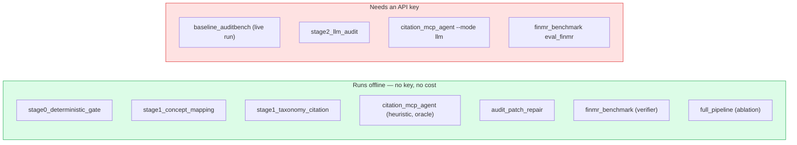

# `docs/setup/` — environment setup

Getting the project running, including without paying for API calls.

| Document | What it covers |
|---|---|
| [SETUP_FREE_MODELS.md](SETUP_FREE_MODELS.md) | Running against free local models (Ollama, Qwen, Llama) instead of paid APIs |
| [quick_start.sh](quick_start.sh) | Environment bootstrap script |

---

## The short version

```bash
python3 -m venv .venv
source .venv/bin/activate
pip install -r requirements.txt

python -m core.verify_data      # confirm the datasets are intact
```

Then check everything still works:

```bash
python scripts/status.py        # ~25s
```

---

## Most of the project needs no API key



That includes the headline result — AuditPatch's 81.5% exact repair is fully
deterministic, so anyone can reproduce it with no key at all. The ablation also
runs free, because it reuses stored predictions committed to `results/`.

## Keys

Read from the environment:

```bash
export ANTHROPIC_API_KEY=...
export OPENAI_API_KEY=...
```

Never commit a key, and never paste one into a chat or an issue. If one is
exposed, rotate it in the provider console — editing it out afterwards does not
help, because it stays in the history.

## First-run downloads

Two things fetch themselves and are gitignored:

| What | Size | Trigger |
|---|---|---|
| FASB US-GAAP taxonomy → `.cache/` | ~11 MB | First use of `core.taxonomy_graph` |
| FinMR dataset → `data/finmr/` | ~85 MB | `python -m approaches.finmr_benchmark.download_finmr` |

Both are self-healing — delete and they come back.
