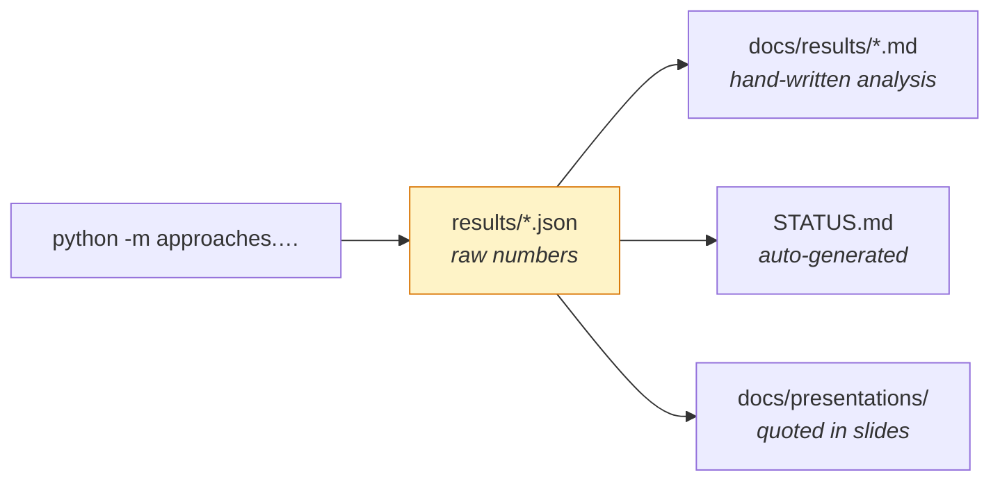

# `results/` — machine-readable output

Every evaluation writes its numbers here as JSON. **Scripts write this folder;
humans write [`docs/results/`](../docs/results/).** If you want prose about what a
number means, that is the other folder.



---

## What is in here

**Evaluation output** — regenerate any of these by re-running its approach.

| File | Produced by | Holds |
|---|---|---|
| `audit_patch_finmr_332.json` | `audit_patch_repair.run_finmr` | **The headline result** — 81.5% exact repair, 0 regressions |
| `audit_patch_finmr_40.json` | same, `--n 40` | Quick-run version |
| `audit_patch_v0_80.json` | `audit_patch_repair.run_v0` | AuditBench prototype loop |
| `stage0_eval.json` | `stage0_deterministic_gate.stage0_eval` | Gate precision and coverage, n=150 |
| `edgar_mapper_eval.json` | `stage1_concept_mapping.edgar_mapper_eval` | Concept mapping coverage |
| `stage1_eval.json` | `stage1_taxonomy_citation.stage1_eval` | Citation coverage vs the static baseline |
| `stage1_citation_eval.json` | `stage1_taxonomy_citation.stage1_citation_eval` | Citation accuracy on broken rows |
| `citation_mcp_heuristic_50.json` | `citation_mcp_agent.eval_agent` | Rule-based picker |
| `citation_mcp_llm_50.json` | same, `--mode llm` | **The tool-locking experiment** — 0 invented citations |
| `citation_mcp_oracle_50.json` | same, `--mode oracle` | The 26.2% ceiling |
| `finmr_eval.json` | `finmr_benchmark.finmr_eval` | Deterministic verifier on 332 filings |
| `finmr_auditbench_format.json` | `finmr_benchmark.finmr_auditbench_format` | FinMR converted to AuditBench shape |
| `finmr_taxonomy_citations.json` | `finmr_benchmark.finmr_taxonomy_citations` | Citations attached to FinMR concepts |
| `pipeline_ablation.json` | `full_pipeline.pipeline_eval` | **The ablation** — false alarms 50% → 28.7% |
| `run_audit_150.json` | `full_pipeline.run_audit` | Combined pipeline run |
| `summary.json` | `baseline_auditbench.main` | Baseline scoring summary |

**Stored LLM predictions** — expensive to regenerate, so they are committed.

| File | What it is |
|---|---|
| `claude-opus-4-6_{correct,single_error,multi_error}_predictions.json` | The baseline run the ablation compares against |
| `intelliaudit_{correct,single_error}_predictions.json` | The full-pipeline run |

Without these the ablation still runs but reports `have_llm: false` and skips the
Config A comparisons — so do not delete them casually.

---

## Reading a filename

```
audit_patch_finmr_332.json
└─ approach ──┘ └data┘ └n┘
```

Most files carry the sample size, so `_332` is the full FinMR set and `_40` is a
quick run of the same thing.

---

## These files are committed on purpose

They are the evidence behind every number in the presentation. Committing them
means a reviewer can check a claim without an API key, a GPU, or a 40-minute run.

Two consequences worth knowing:

**Do not overwrite them with small-sample runs.** A `--n 20` run writes to the
same filename as `--n 332` and quietly replaces the real result with a worse
measurement of a smaller thing. This happened twice during the restructure.

**`scripts/status.py` is safe** — it sets `AUDIT_RESULTS_DIR` to a temp directory,
so health checks never touch this folder.

---

## Regenerating everything

```bash
python -m approaches.stage0_deterministic_gate.stage0_eval --n 150
python -m approaches.stage1_concept_mapping.edgar_mapper_eval --n 150
python -m approaches.stage1_taxonomy_citation.stage1_eval --n 150
python -m approaches.citation_mcp_agent.eval_agent --n 50
python -m approaches.audit_patch_repair.run_finmr
python -m approaches.finmr_benchmark.finmr_eval
python -m approaches.full_pipeline.pipeline_eval
```

All of these run offline except the citation agent in `--mode llm`.
