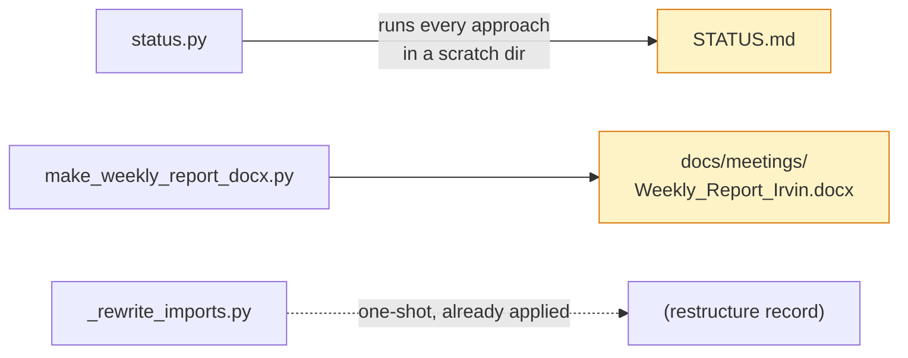

# `scripts/` — repo utilities

Tooling for the repository itself. Nothing here is part of the research pipeline —
for that, see [`approaches/`](../approaches/).



---

## `eval_finmr_all_stages.py` — FinMR through every applicable stage

Walks FinMR records through parse → detect → cite → repair → revalidate, scores
each approach that can consume FinMR, and clearly marks which approaches cannot
(AuditBench-only).

```bash
python scripts/eval_finmr_all_stages.py --n 40          # quick
python scripts/eval_finmr_all_stages.py --n 332 --write # full + markdown report
```

Writes `results/finmr_all_stages.json` and optionally
`docs/results/FINMR_ALL_STAGES.md`.

---

## `status.py` — which approaches actually work

Runs a smoke check on every approach and reports pass/fail, timing, and the
headline number it produced. This is how [`STATUS.md`](../STATUS.md) is generated;
never hand-edit that file.

```bash
python scripts/status.py            # ~25s, small samples
python scripts/status.py --full     # full n, the real numbers
python scripts/status.py --write    # also refresh STATUS.md
python scripts/status.py --only audit_patch    # one approach
```

**It cannot damage anything.** Each check runs with `AUDIT_RESULTS_DIR` pointed at
a temp directory, so the committed evidence in `results/` is never touched.

Three outcomes:

| Result | Meaning |
|---|---|
| `PASS` | Ran to completion; the headline number is shown |
| `FAIL` | Non-zero exit or timeout; the last stderr line is printed |
| `SKIP` | Prerequisite missing — an API key, the FinMR download, or too slow for quick mode. **Not** a failure |

Quick-mode numbers are n=20 and swing well above and below the real figures, so
the generated file labels them as such. Quote
[`MATURITY.md`](../MATURITY.md) or `docs/results/` instead.

### Adding a new approach to the check

Append a tuple to `CHECKS` in `status.py`:

```python
("my_approach", "approaches.my_approach.my_eval",
 ["--n", "20"],        # quick args
 ["--n", "150"],       # full args
 "my_eval.json",       # results filename, or None to take the newest
 m_my_metric,          # a function turning that JSON into one line, or None
 None),                # "apikey" | "finmr" | "slow" | "importonly" | None
```

---

## `make_weekly_report_docx.py` — the weekly report

Generates `docs/meetings/Weekly_Report_Irvin.docx` with real Word tables and
clickable commit links, ready to upload to Drive and open with Google Docs.

```bash
python scripts/make_weekly_report_docx.py
```

**This script is the source of truth**, not the `.docx`. Edit the `MONTHS` list
here and regenerate; do not edit the Word file directly or the next run will
overwrite you. `docs/meetings/WEEKLY_REPORT_IRVIN.md` is the markdown mirror and
should be kept in step.

Structure: `MONTHS` is a list of `(month_name, [(week, date, minutes, [bullets])])`.
Use `c("abc1234")` in a bullet list to emit a commit hyperlink.

Requires `python-docx`, which is in `requirements.txt`.

---

## `_rewrite_imports.py` — historical record

One-shot script that rewrote 125 internal imports when the flat repo was
reorganised into `core/` and `approaches/`. **Already applied — do not run it
again**; it would mangle imports that are now correct.

Kept in the repo because it is the precise record of how every module moved, which
is more useful than a prose description if you ever need to trace where a file
came from. The leading underscore marks it as not-for-use.
